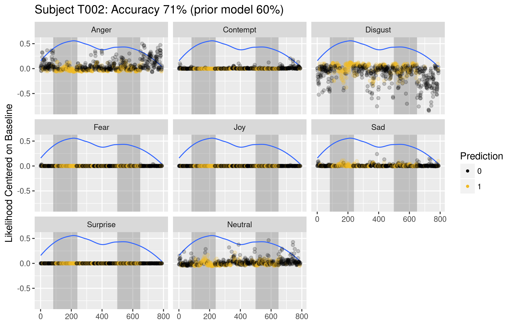
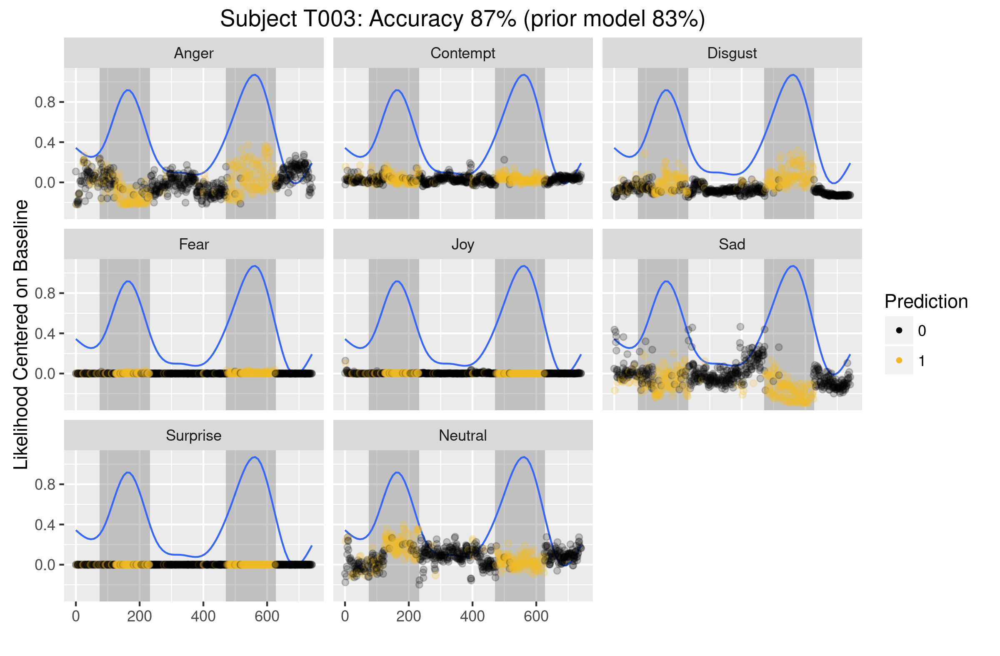

```{r a, echo=FALSE}
suppressPackageStartupMessages(library(ggplot2))
suppressPackageStartupMessages(library(plyr))
suppressPackageStartupMessages(library(reshape2))
suppressPackageStartupMessages(library(caret))
suppressPackageStartupMessages(library(pander))
suppressPackageStartupMessages(library(nnet))

stimuli = read.csv("../Files/data-stimuli.csv")

## Model Performance Metric
metric = function(confusion) {
  sensitivity = confusion[4] / (confusion[2] + confusion[4])
  specificity = confusion[1] / (confusion[1] + confusion[3])
  score = (sensitivity + specificity) / 2
  return(score)
}

```

## Overview

The first pass analysis used summarized statistical measures to fit both a random forest and neural network model to the data. The results primarily showed that aggregating the data over an entire event prevented the two algorithms from detecting texting events. Also, because the data was aggregated, there were very few data points to model between testing and training sets. The random forest algorithm was a better choice than the neural network because of the large number of predictor variables relative to the number of observations. Both models however, were guilty of overfitting. For the next phase of this analysis, I am focussing on looking at the data in its original form. I have chosen to focus on the neural network rather than the random forest mainly because of the data structure. In the previous analysis the aggregated data set contained 119 observations with 40 predictor variables. Since I am using the original data with no statistical measures the data set contains more than 1 million rows on 12 predictor variables.

##  Neural Nets applied to Distracted Driving

In order to standardize the results of my analysis, I have elected to use the R package caret to train all of my models (http://topepo.github.io/caret/index.html). Caret is a modeling framework that allows you to run many different types of models with different combinations of parameter sets at the same time. It can easily use models from other popular packages and offers a rich set of validation tests and diagnostic plots. Another benefit to using this package is enabling parallel computing of cross validation tasks.

I am using k=10 cross validation for all models as well as several combinations of paramters. Training and Testing sets are all approximately the same size 50/50 split. Only Models 1 and 2 have been fully trained.

Model Results: (DS: Data split at 365 Seconds, ES: Training Set taken from Entire Simulation)

| Model     | Data Processing | Data Split | Size | Decay | Training | Testing |
|:----------|:----------------|:-----------|:-----|:------|:---------|:--------|
| Model 1:  | Original        | DS         | 15   | .20   | .783     | .690    |
| Model 2:  | Original        | ES         | 100  | .10   | .798     | .796    |
| Model 3:  | Differencing    | DS         | 15   | .05   | .594     | .571    |
| Model 4:  | Differencing    | ES         | 15   | .05   | .592     | .591    |
| Model 5:  | Moving Avg      | DS         | 30   | .05   | .525     | .527    |
| Model 6:  | Moving Avg      | ES         | 10   | .00   | .528     | .528    |
| Model 7:  | 30 Sec Cut      | DS         | 100  | .10   | .868     | .724    |
| Model 8:  | 30 Sec Cut      | ES         | 100  | .10   | .847     | .820    |
| Model 9:  | 30 Sec Diff     | DS         | 50   | .00   | .741     | .653    |
| Model 10: | 30 Sec Diff     | ES         | 30   | .05   | .790     | .678    |

```r
#################################################################
## Code for running Model 2
## Compute time: 12 hours over 6 CPU

## Set Cross Validation
fit.control = trainControl(method = "cv", number = 10)

## Create combination of model parameters to train on
search.grid = expand.grid(decay = c(0, .05, .1, .2),
                          size = c(1, 3, 5, 10, 15))

## Limit the iterations and weights each model can run
maxIt = 500; maxWt = 10000

fit = train(Texting ~ . - Time, mdl.02.train, method = "nnet",
            trControl = fit.control,
            tuneGrid = search.grid,
            MaxNWts = maxWt,
            maxit = maxIt)

542550 samples, 12 predictors
2 classes: '0', '1'

Resampling: Cross-Validated (10 fold)
Summary of sample sizes: 488295, 488296, 488295, 488294, 488296, 488295, ...
Resampling results across tuning parameters:

decay  size  Accuracy   Kappa
0.00    1    0.6379560  0.2186901
0.00    3    0.7090977  0.3627473
0.00    5    0.7345479  0.4244812
0.00   10    0.7685799  0.5083622
0.00   15    0.7748299  0.5226515
0.05    1    0.6509813  0.2211743
0.05    3    0.7179190  0.3914567
0.05    5    0.7422744  0.4481362
0.05   10    0.7708690  0.5133975
0.05   15    0.7827131  0.5405813 ** Best Model **
0.10    1    0.6448476  0.2514474
0.10    3    0.7161829  0.3820061
0.10    5    0.7461580  0.4562864
0.10   10    0.7715399  0.5151954
0.10   15    0.7818469  0.5390179
0.20    1    0.6503197  0.2436473
0.20    3    0.7190932  0.3910539
0.20    5    0.7449894  0.4524052
0.20   10    0.7728504  0.5181559
0.20   15    0.7821215  0.5392592
```
\newpage

```{r c, echo=FALSE, comment=NA}
load("../R-Data/data-mdl-02.rda")
load("../R-Models/mdl_02_nnet.rda")

plot(mdl.02, main = "Model 2")

x = predict(mdl.02, mdl.02.train, type = "raw")
y = predict(mdl.02, mdl.02.test, type = "raw")

cat("------------------------------------------------------------------")
cat("Neural Network Confusion Matrix")
cat("-------------------------------------------------------------------")
table(Actual = mdl.02.train$Texting, Predicted = x)
cat("(Training Set) Overall Performance:", metric(table(Actual = mdl.02.train$Texting, Predicted = x)))
table(Actual = mdl.02.test$Texting, Predicted = y)
cat("(Testing Set) Neural Net Overall Performance", metric(table(Actual = mdl.02.test$Texting, Predicted = y)))
```

## Plots

The following 3 plots overlay the prediction for model 2 against the test sets for the first 3 subjects. Yellow dots represent predictions for Texting events and the black dots are no texting events. The blue curve is a loess curve for the probability prediction. It shows the overall trend for the predictions by time. It is encouraging that for Subject 001, the probability tends to peak during the periods of texting which are highlighted in gray in the background.

Just as interesting though is the plot for Subject 002 where the model has a horrible fit overall and only predicts texting correctly about 60% of the time. Subject 003 has an excellent fit overall with a large majority of positive predictions occurring during the texting event window.


```{r d, echo=FALSE}

mdl.02.test$Predict = predict(mdl.02, mdl.02.test, type = "raw")
y = predict(mdl.02, mdl.02.test, type = "prob")[2]
mdl.02.test$Prob = y = as.numeric(y$`1`)

sub = 'T001'
x = subset(mdl.02.test, Subject == sub)
x = melt(x, id.vars = c("Subject", "Age_Old", "Gender_Male", "Texting", "Predict", "Prob", "Time"))
y = subset(stimuli, ID == paste(sub,'-007', sep = ''))
y1 = y[2,1]; y2 = y[2, 2]
y3 = y[1,1]; y4 = y[1, 2]

g1 = ggplot(x, aes(x = Time, y = value)) +
  annotate(geom = "rect", xmin = y1, xmax = y2, ymin = -Inf, ymax = Inf, fill = "gray50", alpha = .4) +
  annotate(geom = "rect", xmin = y3, xmax = y4, ymin = -Inf, ymax = Inf, fill = "gray50", alpha = .4) +
  geom_smooth(aes(y = Prob), se = FALSE, size = .5) +
  geom_point(alpha = .02, aes(color = Predict)) +
  scale_x_continuous("") +
  scale_y_continuous("Likelihood Centered on Baseline") +
  scale_color_manual("Prediction", values = c("black", "#f0b923")) +
  facet_wrap(~variable) +
  guides(colour = guide_legend(override.aes = list(alpha = 1, size = 1))) +
  ggtitle("Subject T001: Accuracy 78%")

ggsave(filename = "../Plots/07_g1.png", plot = g1, width = 8, height = 5.25)

```


\newpage

```{r d2, echo=FALSE}

sub = 'T002'
x = subset(mdl.02.test, Subject == sub)
x = melt(x, id.vars = c("Subject", "Age_Old", "Gender_Male", "Texting", "Predict", "Prob", "Time"))
y = subset(stimuli, ID == paste(sub,'-007', sep = ''))
y1 = y[2,1]; y2 = y[2, 2]
y3 = y[1,1]; y4 = y[1, 2]

g2 = ggplot(x, aes(x = Time, y = value)) +
  annotate(geom = "rect", xmin = y1, xmax = y2, ymin = -Inf, ymax = Inf, fill = "gray50", alpha = .4) +
  annotate(geom = "rect", xmin = y3, xmax = y4, ymin = -Inf, ymax = Inf, fill = "gray50", alpha = .4) +
  geom_smooth(aes(y = Prob), se = FALSE, size = .5) +
  geom_point(alpha = .02, aes(color = Predict)) +
  scale_x_continuous("") +
  scale_y_continuous("Likelihood Centered on Baseline") +
  scale_color_manual("Prediction", values = c("black", "#f0b923")) +
  facet_wrap(~variable) +
  guides(colour = guide_legend(override.aes = list(alpha = 1, size = 1))) +
  ggtitle("Subject T002: Accuracy 60%")

ggsave(filename = "../Plots/07_g2.png", plot = g2, width = 8, height = 5.25)

sub = 'T003'
x = subset(mdl.02.test, Subject == sub)
x = melt(x, id.vars = c("Subject", "Age_Old", "Gender_Male", "Texting", "Predict", "Prob", "Time"))
y = subset(stimuli, ID == paste(sub,'-007', sep = ''))
y1 = y[2,1]; y2 = y[2, 2]
y3 = y[1,1]; y4 = y[1, 2]

g3 = ggplot(x, aes(x = Time, y = value)) +
  annotate(geom = "rect", xmin = y1, xmax = y2, ymin = -Inf, ymax = Inf, fill = "gray50", alpha = .4) +
  annotate(geom = "rect", xmin = y3, xmax = y4, ymin = -Inf, ymax = Inf, fill = "gray50", alpha = .4) +
  geom_smooth(aes(y = Prob), se = FALSE, size = .5) +
  geom_point(alpha = .02, aes(color = Predict)) +
  scale_x_continuous("") +
  scale_y_continuous("Likelihood Centered on Baseline") +
  scale_color_manual("Prediction", values = c("black", "#f0b923")) +
  facet_wrap(~variable) +
  guides(colour = guide_legend(override.aes = list(alpha = 1, size = 1))) +
  ggtitle("Subject T003: Accuracy 83%")

ggsave(filename = "../Plots/07_g3.png", plot = g3, width = 8, height = 5.25)

```





\newpage

Accuracy by Subject:

```{r e, echo=FALSE}

mdl.02.train$Predict = predict(mdl.02, mdl.02.train, type = "raw")

subject = as.character(unique(mdl.02.train$Subject))

tab = data.frame()

for (i in 1:59) {
  y1 = subset(mdl.02.train, Subject == subject[i])
  y2 = subset(mdl.02.test, Subject == subject[i])

  x1 = metric(table(Actual = y1$Texting, Predicted = y1$Predict))
  x2 = metric(table(Actual = y2$Texting, Predicted = y2$Predict))

  tab = rbind(tab, data.frame(Subject = subject[i], Train = x1, Test = x2))

}

tab = arrange(tab, desc(Test))
tab$Train = round(tab$Train, 3)
tab$Test = round(tab$Test, 3)
subject = as.character(tab$Subject)

tab2 = t(tab)
tab2 = data.frame(tab2)
colnames(tab2) = subject
tab2 = tab2[-1, ]

pander(tab2, split.table = 90)

```

## Conclusions and Next Steps

So far the neural net models have shown encouraging results in the ability to detect texting events for some subjects based on facial expressions alone. It clearly helps model performance to consider each individual separately. In my next few sessions I would like to finsih building and testing the performance for the rest of the modeling scenarios I have proposed. I would also like to look into some additional neural net models that have recursive features. So far in the models I have trained I have ignored the time component which might be valuable.
