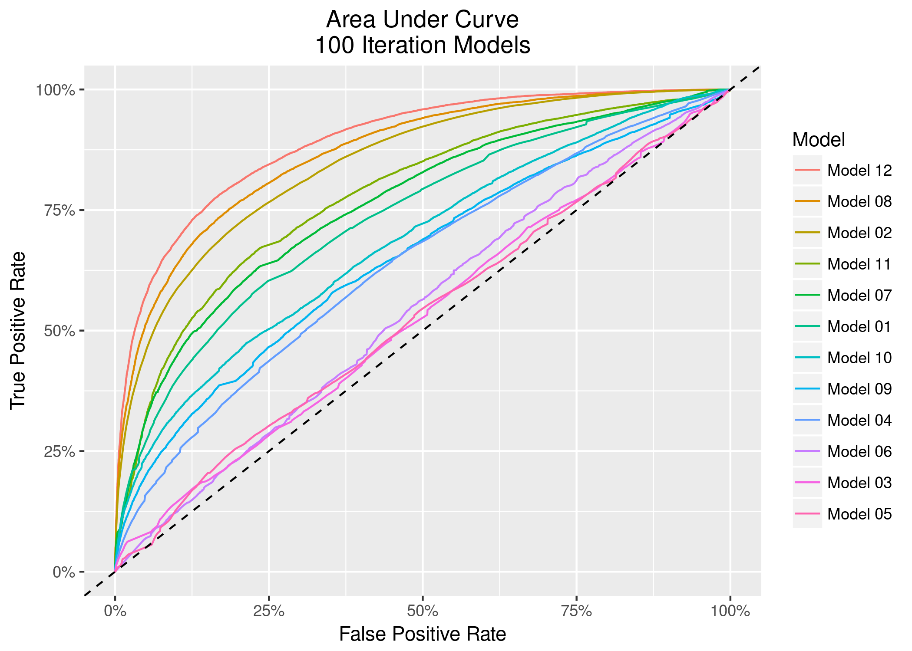
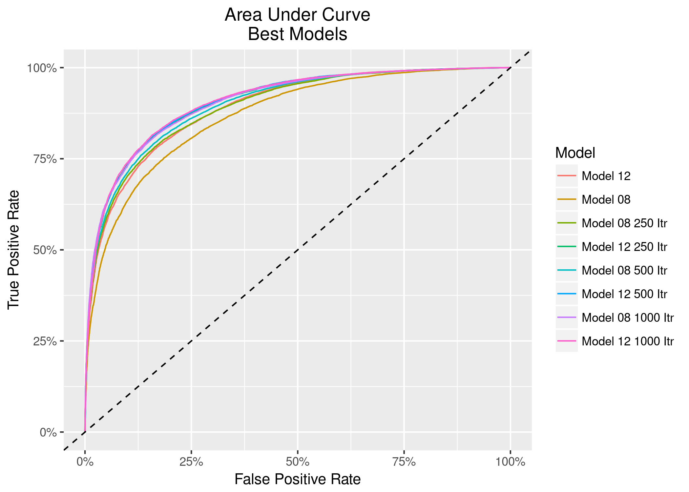

#### **Why not use ROC curves to graphically compare model performance?**

I did not think about this at all, but I think its a great idea.

##### Model Performance

| Model         | Data Processing      | Data Split     | MaxItr  | Size   | Decay   | Training | Testing  | AUC      |
|:--------------|:---------------------|:---------------|:--------|:-------|:--------|:---------|:---------|:---------|
| Model 1:      | Original             | 365 Split      | 100     | 50     | .20     | .760     | .676     | .734     |
| Model 2:      | Original             | Entire Sim     | 100     | 50     | .20     | .754     | .754     | .847     |
| Model 3:      | Differencing         | 365 Split      | 100     | 10     | .00     | .518     | .516     | .526     |
| Model 4:      | Differencing         | Entire Sim     | 100     | 25     | .10     | .572     | .571     | .637     |
| Model 5:      | Moving Avg           | 365 Split      | 100     | 10     | .00     | .503     | .502     | .527     |
| Model 6:      | Moving Avg           | Entire Sim     | 100     | 10     | .00     | .528     | .528     | .544     |
| Model 7:      | 1/2 Sec Cut          | 365 Split      | 100     | 50     | .10     | .820     | .698     | .761     |
| **Model 8:**  | **1/2 Sec Cut**      | **Entire Sim** | **100** | **50** | **.20** | **.788** | **.779** | **.868** |
| Model 9:      | 1/2 Sec Diff         | 365 Split      | 100     | 50     | .10     | .633     | .602     | .650     |
| Model 10:     | 1/2 Sec Diff         | Entire Sim     | 100     | 50     | .20     | .682     | .622     | .681     |
| Model 11:     | 1/2 Sec Cut Stat     | 365 Split      | 100     | 50     | .10     | .846     | .716     | .781     |
| **Model 12:** | **1/2 Sec Cut Stat** | **Entire Sim** | **100** | **50** | **.20** | **.820** | **.803** | **.891** |

\newpage

##### Further Training Best Models

| Model        | Data Processing  | Data Split     | MaxItr   | Size   | Decay   | Training | Testing  | AUC      |
|:-------------|:-----------------|:---------------|:---------|:-------|:--------|:---------|:---------|:---------|
| Model 8:     | 1/2 Sec Cut      | Entire Sim     | 250      | 50     | .10     | .816     | .804     | .893     |
| Model 8:     | 1/2 Sec Cut      | Entire Sim     | 500      | 50     | .10     | .828     | .810     | .899     |
| **Model 8:** | **1/2 Sec Cut**  | **Entire Sim** | **1000** | **50** | **.10** | **.842** | **.820** | **.906** |
| Model 12:    | 1/2 Sec Cut Stat | Entire Sim     | 250      | 50     | .10     | .858     | .823     | .906     |
| Model 12:    | 1/2 Sec Cut Stat | Entire Sim     | 500      | 50     | .20     | .864     | .823     | .907     |
| Model 12:    | 1/2 Sec Cut Stat | Entire Sim     | 1000     | 50     | .10     | .871     | .824     | .908     |

##### Accuracy by Subject

| &nbsp;     | T022  | T086  | T007  | T006  | T018  | T035  | T083  | T076  | T081  | T064  | T020  | T012  | T074  | T009  | T013  | T088  | T003  | T032  | T011  | T044 | **TOP 20** |
|:-----------|:------|:------|:------|:------|:------|:------|:------|:------|:------|:------|:------|:------|:------|:------|:------|:------|:------|:------|:------|:-----|:-----------|
| Train      | 0.981 | 0.960 | 0.919 | 0.943 | 0.940 | 0.956 | 0.956 | 0.949 | 0.929 | 0.922 | 0.931 | 0.928 | 0.925 | 0.914 | 0.907 | 0.937 | 0.907 | 0.915 | 0.916 | .915 | **.932**   |
| Test       | 0.971 | 0.952 | 0.948 | 0.942 | 0.937 | 0.936 | 0.932 | 0.927 | 0.923 | 0.919 | 0.918 | 0.913 | 0.909 | 0.905 | 0.903 | 0.896 | 0.896 | 0.895 | 0.881 | .880 | **.919**   |
| GenderMale | 0     | 0     | 1     | 0     | 0     | 0     | 1     | 1     | 1     | 0     | 0     | 0     | 1     | 1     | 1     | 1     | 1     | 1     | 1     | 1    | **12**     |
| AgeOld     | 0     | 1     | 0     | 0     | 0     | 1     | 1     | 1     | 0     | 0     | 0     | 0     | 1     | 0     | 0     | 1     | 0     | 1     | 0     | 0    | **7**      |

| &nbsp;     | T080  | T016  | T005  | T060  | T039  | T015  | T008  | T046  | T029  | T079  | T051  | T073  | T082  | T024  | T010  | T001  | T066  | T017  | T033  | T042  | **MID 20** |
|:-----------|:------|:------|:------|:------|:------|:------|:------|:------|:------|:------|:------|:------|:------|:------|:------|:------|:------|:------|:------|:------|:-----------|
| Train      | 0.897 | 0.904 | 0.867 | 0.911 | 0.880 | 0.868 | 0.879 | 0.883 | 0.842 | 0.892 | 0.884 | 0.855 | 0.866 | 0.829 | 0.847 | 0.867 | 0.855 | 0.824 | 0.825 | 0.843 | **.865**   |
| Test       | 0.872 | 0.871 | 0.864 | 0.859 | 0.853 | 0.850 | 0.848 | 0.847 | 0.839 | 0.837 | 0.832 | 0.831 | 0.830 | 0.827 | 0.826 | 0.825 | 0.819 | 0.817 | 0.803 | 0.802 | **.837**   |
| GenderMale | 0     | 0     | 1     | 0     | 0     | 1     | 0     | 1     | 0     | 0     | 1     | 0     | 1     | 0     | 0     | 1     | 0     | 1     | 0     | 1     | **8**      |
| AgeOld     | 0     | 0     | 0     | 0     | 1     | 0     | 0     | 1     | 1     | 0     | 1     | 1     | 0     | 0     | 0     | 0     | 0     | 0     | 1     | 1     | **7**      |

| &nbsp;     | T031  | T040  | T061  | T036  | T047  | T084  | T077  | T014  | T004  | T021  | T019  | T002  | T054  | T025  | T041  | T034  | T023  | T038  | T027  | **BOTTOM 19** |
|:-----------|:------|:------|:------|:------|:------|:------|:------|:------|:------|:------|:------|:------|:------|:------|:------|:------|:------|:------|:------|:--------------|
| Train      | 0.846 | 0.814 | 0.796 | 0.800 | 0.789 | 0.803 | 0.792 | 0.828 | 0.771 | 0.812 | 0.746 | 0.742 | 0.774 | 0.760 | 0.719 | 0.704 | 0.711 | 0.674 | 0.651 | **.764**      |
| Test       | 0.794 | 0.790 | 0.787 | 0.783 | 0.782 | 0.776 | 0.766 | 0.758 | 0.758 | 0.757 | 0.742 | 0.735 | 0.731 | 0.724 | 0.720 | 0.700 | 0.682 | 0.665 | 0.640 | **.741**      |
| GenderMale | 0     | 1     | 1     | 1     | 0     | 1     | 0     | 0     | 0     | 1     | 1     | 0     | 1     | 0     | 0     | 1     | 1     | 1     | 0     | **10**        |
| AgeOld     | 1     | 1     | 0     | 1     | 1     | 1     | 1     | 0     | 0     | 0     | 0     | 0     | 1     | 1     | 1     | 1     | 0     | 1     | 1     | **12**        |

|        | Max Accuracy | Min Accuracy | Proportion Male | Proportion Old |
|:-------|:-------------|:-------------|:----------------|:---------------|
| Top 20 | .971         | .880         | 60%             | 35%            |
| Mid 20 | .872         | .802         | 40%             | 35%            |
| Bot 19 | .794         | .640         | 50%             | 60%            |

#### **Are you trying to detect whether texting occurred during a given interval or a single observation?**

Initially I was looking at individual observations, but as I tried different approaches I ended up aggregating the data and found those models to be the best performing.

#### **Baselining: What is the purpose?**

My goal was to remove the effect of the simulation from the texting trial. The simulations involved active traffic and a detour which each driver had to navigate. Since trial 4 was identical to trials 5, 6, and 7 minus the events that took place, it seemed like the natural choice.

#### **Why do you say there was evidence that one size fits all model will not work?**

At this stage I was aggregating data at the subject level by event and I think the range of values were all over the place which prevented the models I tried from being any good. I proposed that adding a factor variable for subject would allow me to model individuals driving behavior that might be more successful at detecting texting.

#### **On Time omission -- why not include lagged variables?**

In retrospect this probably would have been a good thing to try. The farthest I went looking into time series was trying differencing which ended up being the worst of all of the methods I experimented with.

#### **Does including age and gender as well as Subject in the model cause problems due to collinerity?**

I mainly included included age and gender so that there were parameters availble to account for universal age and gender effects, if there were any. I dont think there is an issue with collinerity because Im not inferring anything about the weights (coefficients).

#### **Exmplain (sens+spec)/2**

I presented this in a more complicated way than was neccessary. It turns out that the formula is equivalent to the "total percentage correct". I initially set it up that way incase I wanted to penalize false positives or negatives more. I had a multivariate course last year that did this. I never ended up doing that so I will eliminate that metric and just represent it as percentage correct.

#### **Why move 60/40 to 50/50?**

Only because the initial aggregate data I created had very few observations so I was just trying to have more data to train on. There was no real scientific reason for this. I may cut this exploratory section out entirely.

#### **Less on interpreting nnet weights**

Agreed. I have pretty much concluded that trying to extract and interpret weights on large nueral nets is very tricky and not very helpful.

#### **Reduce or cut material on initial analysis and aggregated data**?

Agreed.
