========================================================
autosize: true
font-family: "DejaVu Sans Mono"
width: 2100
height: 1400
css: custom.css

<br><br>
<h1><center>Distracted Driving:<br><br>Detecting Texting with<br><br>Neural Networks</center></h1><br>
<style color='#FFFFFF'></style>
<h3 style="color:white" font-family: "DejaVu Sans Mono"><center>Joseph Blubaugh<br><br>29 March 2017</center></h3>


Contents
========================================================
title: true
<br>

* Data Introduction, Preparation, and Project Management
* Exploratory Analysis and Model Proposal
* Understanding Basic Neural Nets
* Model Training and Selection
* Exploring Model Effects


Data Introduction, Preparation, and Project Management
========================================================
type: section
title: false

<h1><center>Data Introduction<br><br>Data Extraction and Preparation<br><br>Project Management</center></h1><br>


Data Introduction
========================================================

<center>
* <small>The data in this project are of 8 driving simulations for 66 individuals ranging from 3,000 to 30,000 observations per simulation.</small>
* <small>Every simulation observation contains likelihood scores for 8 facial expressions recorded at a fixed interval of .03 seconds.</small>
* <small>Stimuli data which records targetted events introduced into each simulation and basic demographic data on each subject are also available.</small>
* <small>There are over 6.7 million observations in the entire dataset spread accross 777 files.</small>
</center>

<center>**T001-001.xlsx (Subject 01, Simulation 01)**<br>
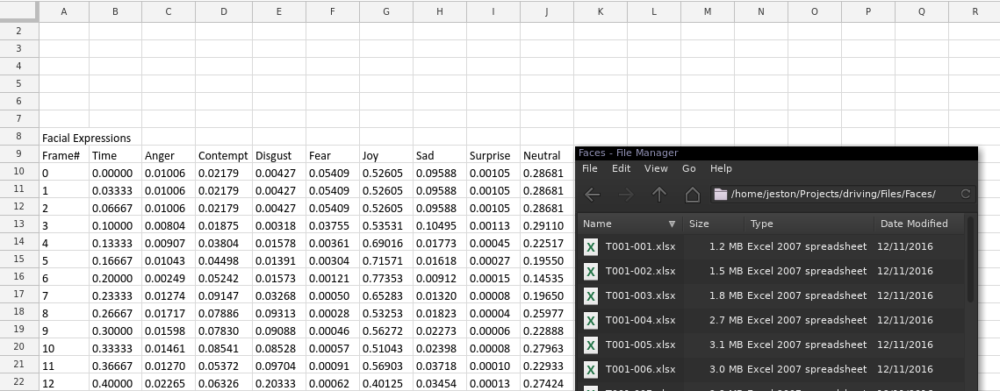
</center>

<br> 

<center>
* <small>The data set used in this project was originally collected and analyzed in **[Dissecting Driver Behaviors Under Cognitive, Emotional, Sensorimotor, and Mixed Stressors](http://www.nature.com/articles/srep25651)**, Scientific Reports 6, Article number: 25651 (2016).</small>
</center>


Data Extraction
========================================================

<center>
* <small>**[Python scripts](https://github.com/JestonBlu/Driving/tree/master/Files)** were used to extract and combine the 509 driving simulation files and 267 stimuli files into combined data sets.</small>
* <small>The subject-simulation identifier was the name of each file. A column labeled ID was created based on the file name to identify the original data set.</small>
</center>

<center>**Sample of data-faces.csv**


| Frame|   Time|  Anger| Contempt| Disgust|   Fear|    Joy|    Sad| Surprise| Neutral|ID       |
|-----:|------:|------:|--------:|-------:|------:|------:|------:|--------:|-------:|:--------|
|     0| 0.0000| 0.0101|   0.0218|  0.0043| 0.0541| 0.5260| 0.0959|   0.0010|  0.2868|T001-001 |
|     1| 0.0333| 0.0101|   0.0218|  0.0043| 0.0541| 0.5260| 0.0959|   0.0010|  0.2868|T001-001 |
|     2| 0.0667| 0.0101|   0.0218|  0.0043| 0.0541| 0.5260| 0.0959|   0.0010|  0.2868|T001-001 |
|     3| 0.1000| 0.0080|   0.0187|  0.0032| 0.0375| 0.5353| 0.1050|   0.0011|  0.2911|T001-001 |
|     4| 0.1333| 0.0091|   0.0380|  0.0158| 0.0036| 0.6902| 0.0177|   0.0004|  0.2252|T001-001 |
|     5| 0.1667| 0.0104|   0.0450|  0.0139| 0.0030| 0.7157| 0.0162|   0.0003|  0.1955|T001-001 |

</center>

<center>**Sample of data-stimuli.csv**


| Start|    End| Event.Switch| Event.Type|Event                  |ID       |
|-----:|------:|------------:|----------:|:----------------------|:--------|
|  86.5| 246.50|            1|          1|Analytical Questions   |T001-005 |
| 508.5| 657.50|            1|          2|Mathematical Questions |T001-005 |
| 107.5| 269.25|            1|          3|Emotional Questions    |T001-006 |
| 521.0| 674.75|            1|          3|Emotional Questions    |T001-006 |
|  81.0| 240.00|            1|          4|Texting                |T001-007 |
| 510.0| 671.00|            1|          4|Texting                |T001-007 |

</center>


<center>
<left><div class="note">
  - <small>NOTE: 2 simulation files started on different rows than the rest of the 507 files and had to be manually corrected.</small>
    - <small>T034-005.xlsx: header starts on row 8 </small>
    - <small>T009-006.xlsx: header starts on row 10 </small>
</div>
</center>


Data Preparation
========================================================

<center>

* <small>The event data captured the starting and ending times of events only.</small>
* <small>A loop function was written to go through each record and compare time between the simulation and the starting/ending time of the event.</small>
* <small>If the simulation time fell within the starting/ending time interval in the event data, then all of the records in the time interval were coded with that event (ie: **Texting**)</small>
* <small>All observations outside of the event time interval were coded as **No Event**.</small>

<br>

**Sample of Cleaned Data Showing an Event Transition**


|Subject |Trial |Age |Gender | Frame|   Time| Event.Switch|Event    | Action|  Anger| Contempt| Disgust|  Fear|    Joy|    Sad| Surprise| Neutral|Texting |
|:-------|:-----|:---|:------|-----:|------:|------------:|:--------|------:|------:|--------:|-------:|-----:|------:|------:|--------:|-------:|:-------|
|T001    |007   |Y   |M      |  2427| 80.900|            0|No Event |      0| 0.0909|   0.0575|  0.4205| 3e-04| 0.0011| 0.1343|        0|  0.2954|0       |
|T001    |007   |Y   |M      |  2428| 80.933|            0|No Event |      0| 0.0612|   0.0397|  0.4293| 4e-04| 0.0011| 0.1630|        0|  0.3052|0       |
|T001    |007   |Y   |M      |  2429| 80.967|            0|No Event |      0| 0.1034|   0.0963|  0.3186| 2e-04| 0.0013| 0.0856|        0|  0.3946|0       |
|T001    |007   |Y   |M      |  2430| 81.000|            1|Texting  |      4| 0.0363|   0.4976|  0.0171| 1e-04| 0.0024| 0.0069|        0|  0.4396|1       |
|T001    |007   |Y   |M      |  2431| 81.033|            1|Texting  |      4| 0.0059|   0.7285|  0.0027| 4e-04| 0.0068| 0.0063|        0|  0.2493|1       |
|T001    |007   |Y   |M      |  2432| 81.067|            1|Texting  |      4| 0.0058|   0.6890|  0.0035| 4e-04| 0.0077| 0.0068|        0|  0.2868|1       |

<br>

<left><div class="note">
  - <small>NOTE: The average texting event lasted 2.5 minutes, but we dont really know what occurred during the event time interval. Was there one long texting action or was the event made up of a series of sending and receiving texts?</small>
</div></left>

</center>


Project Management
========================================================

<br>

**Reproducible Research**

* <small>Code, plots, and this presentation are organized and hosted in a github repository.</small>
* <small>The main page includes steps to reproduce the data set and models</small>
* <small>The data is too large to be hosted and would need to be retrieved elsewhere</small>


<br>

<left><div class="note">
<center><small>Github Project: [https://github.com/jestonblu/driving](https://github.com/jestonblu/driving)</small></center>
</div>
</left>


***

<center>
**Github Project Page**
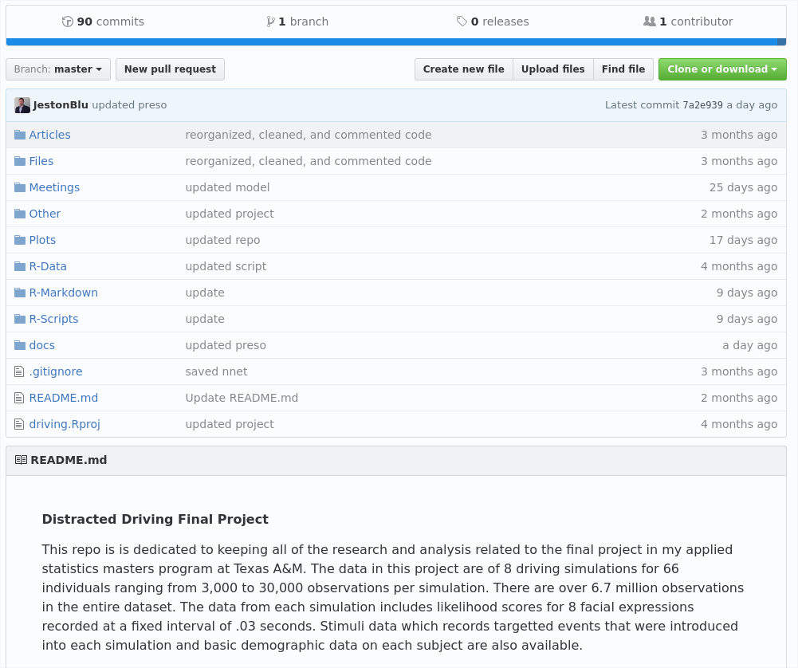
</center>


Exploratory Analysis and Model Proposal
========================================================
type: section
title: false

<br><br>
<h1><center>Exploratory Analysis<br><br>and<br><br>Model Proposal</center></h1><br>


Exploratory Analysis
========================================================

<center>
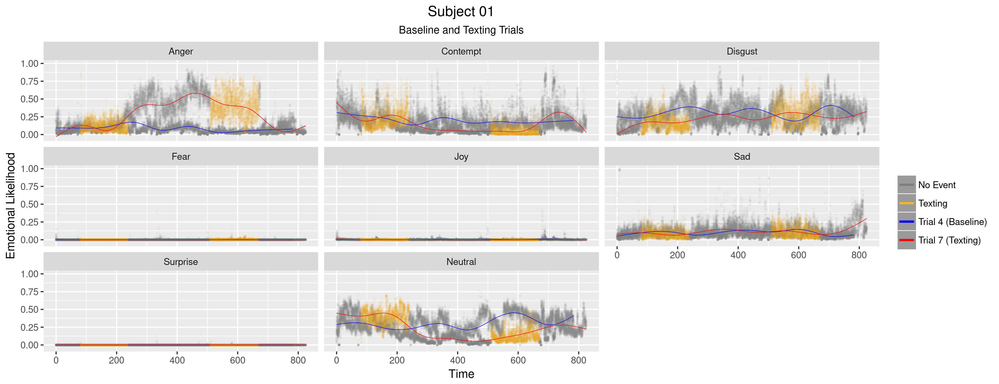
</center>

* <small>The yellow and gray points represent events during the trials</small> 
* <small>The baseline trial has no events and is gray throughout.</small>
* <small>**LOESS (Local Polynomial Regression)** lines display the moving average over the entire simulation</small>
* <small>Many subjects displayed visual differences between the texting simulation and the baseline simulation</small>


Exploratory Analysis
========================================================

<center>
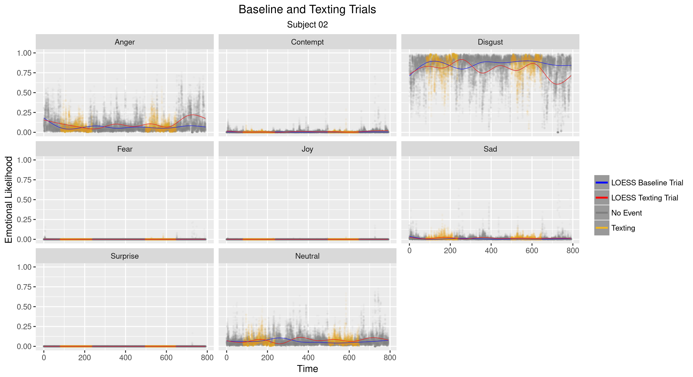
</center>

<center>
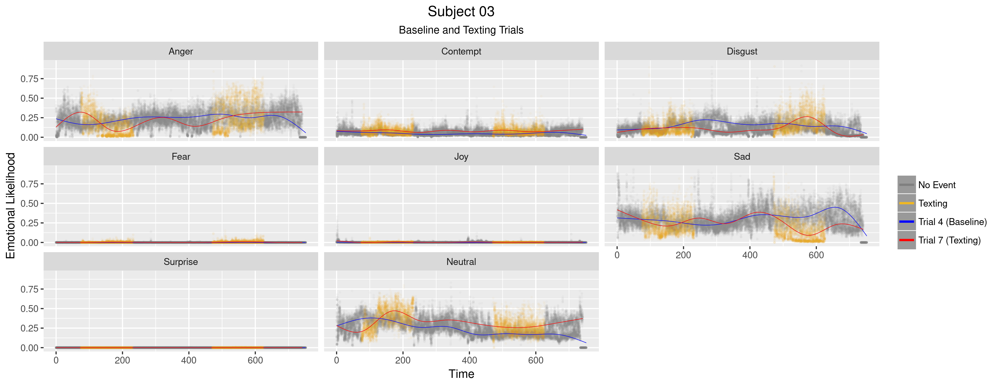
</center>

*****

<center>
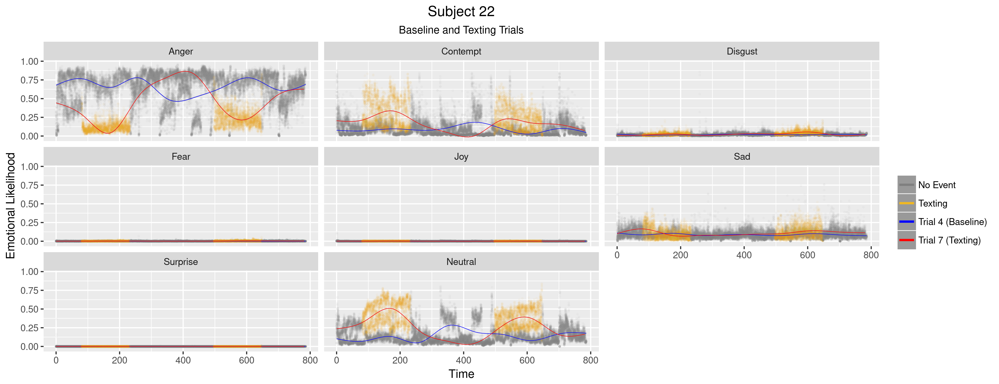
</center>

<center>
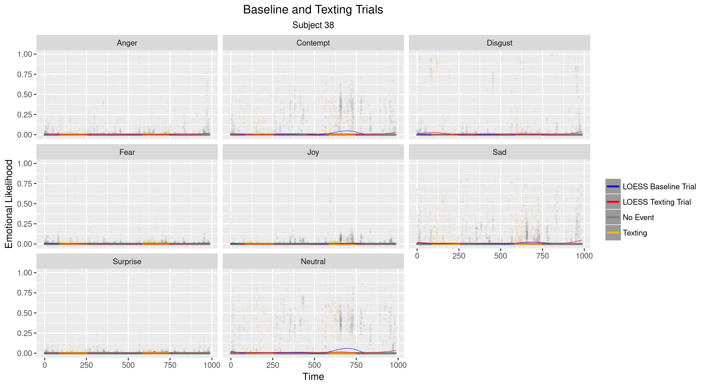
</center>


Exploratory Analysis
========================================================

<center>
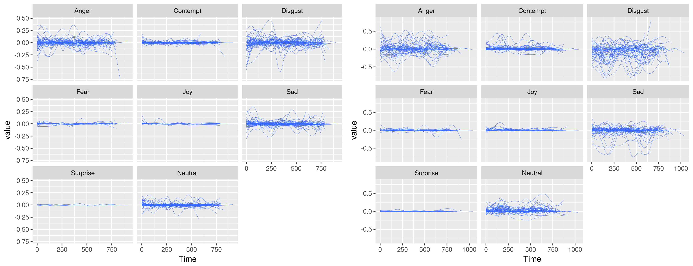
</center>

* <small>The same LOESS lines were used to show all 59 subjects on a single plot</small>
* <small>All observations were centered on the overall average of the baseline simulation</small>
* <small>Anger, Contempt, Disgust, and Neutral displayed more variation than the other emotions for both trials</small>


Model Proposal
========================================================

<center>

</center>

********

<br> 

**Takeaways**

* <small>Differences in variation between the trials suggest that it may be possible to build a model capable of predicting a texting event</small>

* <small>Subject specific plots are unique enough that a individual subjects variables may be needed in modeling</small>

* <small>**Baseline Trial**: Trial 4 was used as a baseline trial because the conditions were identical to the Texting Trial (dense traffic with detour)</small>

<br>

**Model Proposal**: 

* <small>Train Neural Networks using emotional likelihoods and demographics to predict when a subject is texting</small>
  * <small>Well suited for large data sets of continuous variables</small>
  * <small>Analogous to logistic regression and appropriate for predicting probabilities</small>


Basic Nueral Networks
========================================================
type: section
title: false

<br><br>
<h1><center>Understanding Basic<br><br>Neural Networks</center></h1><br>


Neural Network Basics
========================================================


<center>
**Basic Neural Network Example**
<br>
</center>

<center>**General Model Form**</center>
<br>
$$nnet(O1 \sim X1 + X2, size = 3)$$


*******

<br>


**Feed-Forward Neural Networks**
* <small>Class of Statistical Learning model</small>
* <small>Uses a training set for tuning the model and a testing set for measuring performance</small>
* <small>Similar to logistic regression</small>
* <small>Typically displayed as a diagram of connected nodes</small>

<br>

**Neural Network Components**
* <small>**Nodes:**</small>
  * <small>Input Nodes: Input values of the predictor variables</small>
  * <small>Hidden and Output Nodes: Value are the sumproduct of the connected weights</small>
* <small>**Weights:** Represents the transformation that takes place between nodes</small>
* <small>**Activation Function:** Transforms the output into an appropriate scale</small>
  * <small>For logistic regression, the sigmoid function: $S(x) = \frac{1}{1 + \exp(-x)}$</small>


Neural Network Basics
========================================================

**Step 1:** Model is Initialized with Random Weights

<br>

**Step 2:** Calculate Hidden Weights and Output Node Prediction

* <small>Hidden Node values are the sum product of the connected weights and input nodes</small>


<center><small>
$$
\begin{align}
  H1 = & (1)(.2) + (1)(.4) = 0.6, \text{  } S(0.6) = .645 \\
  H2 = & (1)(.1) + (1)(.6) = 0.7, \text{  }S(0.7) = .668 \\
  H3 = & (1)(.7) + (1)(.3) = 1.0, \text{  }S(1.0) = .731 \\
\end{align}
$$
</small></center>

* <small>Output Node Prediction</small>

<center><small>
$$
  O1 = (.645)(.3) + (.668)(.5) + (.731)(.7) = 1.039 \\
  S(1.039) = .739
$$
</small></center>

* <small>Model Error: **.739**</small>

<center>
<div class="note">
NOTE: Activation Function <br>
<small>
$$
\begin{align}
S(x) = & \frac{1}{1 + \exp(-x)}
\end{align}
$$
</small>
</div>
</center>

*******

<center>
**First Iteration of a Basic Neural Network**
<br>
</center>

<center>
<small>
<div class="note">NOTE: Grayed values did not change from previous step</div>
</small>
</center>


Neural Network Basics
========================================================

**Step 3:** Update Weights Based on Error

* <small>Update Weights between Hidden Layer and Output Node</small>

<center><small>
$$
\begin{align}
  Delta = & S'(.739) = .2187 \\
  \\
  DeltaChange = & (.2187) / [.645, .668, .731] = [.339, .327, .299] \\
  \\
  w_7 = & .645 - .339 = .306 \\
  w_8 = & .668 - .327 = .341 \\
  w_9 = & .731 - .299 = .432 \\
\end{align}
$$
</small></center>

* <small>Update Weights between Input Node and Hidden Layer</small>


<center><small>
$$
\begin{align}
  DeltaWeights = & Delta / [.3, .5, .7] * S'([.6, .7, 1]) \\
               = & [.167, .097, .061] \\
               \\
  DeltaChange  = & DeltaWeights / [1, 1] \\
               = & [.167, .097, .061, .167, .097, .061] \\
               \\
  w_1 = & .2 - .167 = .033 \\
  w_2 = & .1 - .097 = .003 \\
  w_3 = & .7 - .061 = .639 \\
  w_4 = & .4 - .167 = .233 \\
  w_5 = & .6 - .097 = .503 \\
  w_6 = & .3 - .061 = .239 \\
\end{align}
$$
</small></center>


*******

**Step 4**: Repeat steps 2-3 to update node values
* <small>S(.633) = .653, Error = **.653** vs previous **.739**</small>

<center>
**First Iteration of a Basic Neural Network**
<br>
</center>

<center>
<left><div class="note">
* <small>Grayed values did not change from previous step</small>
* <small>$S'(x) = S(x)(1 - S(x))$</small>
</div></left>
</center>


Model Fitting and Selection
========================================================
type: section
title: false

<br><br>
<h1><center>Model Fitting and Selection</center></h1><br>


Model Fitting
========================================================
left: 30%

<small>
<center>
**Neural Network Model Design**

</center>

*******

<br><br>
**General Model Form**

$$
\begin{align*}
  nnet(Texting = & \text{ } Subject + Age + Gender + Anger + Contempt \text{ } + \\
  & \text{ } Digust + Fear + Joy + Sad + Surprise + Neutral)\\
\end{align*}
$$

**Modeling Strategy**
  * Train the same general model on various slices of the data to see what works best
  
  * 12 total training/testing data sets created from the combination of Data Processing and Data Split methods
  
  * **Data Processing**
    * **Original**: Emotions in the original form measured in .03 second intervals.
    * **Differencing**: First order differening of the original observations.
    * **Moving Avg**: Moving averages n=30 for all of the emotions.
    * **1/2 Sec Cut**: Time cut into 1/2 second intervals with the average value recorded.
    * **1/2 Sec Diff**: First order differncing of the 1/2 second cut data.
    * **1/2 Sec Cut Stat**: 1/2 Sec Cut with additional sd, min, max, iqr, and median.<br><br>

  * **Data Split**
    * **365 Split**: The data are split at the 365 second, approximately half way through the texting simulation.
    * **Entire Sim**: The training set is randomly selected from the entire simulation.
</small>


Model Fitting
========================================================

<small>

**Statistical Software**

* R's **[nnet](https://cran.r-project.org/web/packages/nnet/index.html)** package for feed-forward neural networks

* **The Caret Package**
  * **[Caret](http://topepo.github.io/caret/index.html)** is a modeling framework for training and testing classification and regression models
  * Uses models from other packages and offers a rich set of validation test and diagnostic plots
  * Can implement parallel processing of cross validation tasks<br><br>
  
**Performance and Validation Testing**
  * k=10 cross validation for training sets
  * AUC (Area Under Curve) and total accuracy<br><br>

**Model Search Parameters**
  * **Max Iterations**: The number of iterations allowed for training
    * 100 (500 and 1000 iterations are run for the best models)
  * **Size**: The number of nodes in the hidden layer. Increases training time exponentially
    * [1, 10, 25, 50]
  * **Decay**: A penality applied to weights after each iteration. Moves weights that dont update towards zero.
    * [0, .1, .2] <br><br>
    
<center><div class = "note">
NOTE: Each Model is trained 120 times
* (k=10 cross validation) x (12 combinations of size and decay)
</div></center>

</small>


Model Selection
========================================================
left: 55%

<br> 

**Model Performance with 100 Iteration Limit**
<small>

| Model         | Data Processing      | Data Split     | MaxItr  | Size   | Decay   | Training | Testing  | AUC      |
|:--------------|:---------------------|:---------------|:--------|:-------|:--------|:---------|:---------|:---------|
| Model 1:      | Original             | 365 Split      | 100     | 50     | .20     | .760     | .676     | .734     |
| Model 2:      | Original             | Entire Sim     | 100     | 50     | .20     | .754     | .754     | .847     |
| Model 3:      | Differencing         | 365 Split      | 100     | 10     | .00     | .518     | .516     | .526     |
| Model 4:      | Differencing         | Entire Sim     | 100     | 25     | .10     | .572     | .571     | .637     |
| Model 5:      | Moving Avg           | 365 Split      | 100     | 10     | .00     | .503     | .502     | .527     |
| Model 6:      | Moving Avg           | Entire Sim     | 100     | 10     | .00     | .528     | .528     | .544     |
| Model 7:      | 1/2 Sec Cut          | 365 Split      | 100     | 50     | .10     | .820     | .698     | .761     |
| **Model 8:**  | **1/2 Sec Cut**      | **Entire Sim** | **100** | **50** | **.20** | **.788** | **.779** | **.868** |
| Model 9:      | 1/2 Sec Diff         | 365 Split      | 100     | 50     | .10     | .633     | .602     | .650     |
| Model 10:     | 1/2 Sec Diff         | Entire Sim     | 100     | 50     | .20     | .682     | .622     | .681     |
| Model 11:     | 1/2 Sec Cut Stat     | 365 Split      | 100     | 50     | .10     | .846     | .716     | .781     |
| **Model 12:** | **1/2 Sec Cut Stat** | **Entire Sim** | **100** | **50** | **.20** | **.820** | **.803** | **.891** |

</small>

**Additional Training for Best Models**
<small>

| Model        | Data Processing  | Data Split     | MaxItr   | Size   | Decay   | Training | Testing  | AUC      |
|:-------------|:-----------------|:---------------|:---------|:-------|:--------|:---------|:---------|:---------|
| Model 8:     | 1/2 Sec Cut      | Entire Sim     | 250      | 50     | .10     | .816     | .804     | .893     |
| Model 8:     | 1/2 Sec Cut      | Entire Sim     | 500      | 50     | .10     | .828     | .810     | .899     |
| **Model 8:** | **1/2 Sec Cut**  | **Entire Sim** | **1000** | **50** | **.10** | **.842** | **.820** | **.906** |
| Model 12:    | 1/2 Sec Cut Stat | Entire Sim     | 250      | 50     | .10     | .858     | .823     | .906     |
| Model 12:    | 1/2 Sec Cut Stat | Entire Sim     | 500      | 50     | .20     | .864     | .823     | .907     |
| Model 12:    | 1/2 Sec Cut Stat | Entire Sim     | 1000     | 50     | .10     | .871     | .824     | .908     |

</small>

<div class="note">
<center><small>NOTE: Blue indicates best models</small></center>
</div>

**********

<br><br>

<center>
<br>
<br><br>
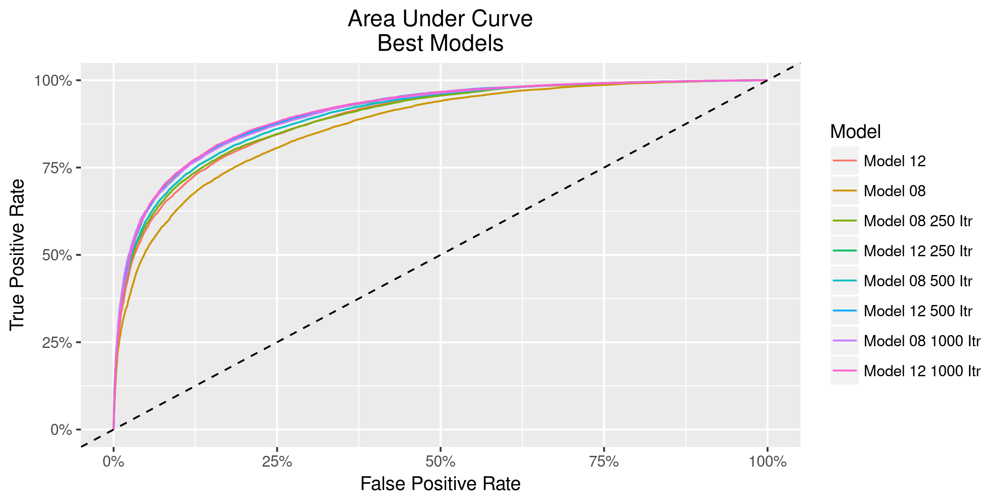<br>
</center>


Model Fitting
========================================================


<small>
<center>**Model Training and Validation**</center>

```r
## Set Cross Validation
fit.control = trainControl(method = "cv", number = 10)

## Create combination of model parameters to train on
search.grid = expand.grid(decay = c(0, .1, .2), 
                          size = c(1, 10, 25, 50))

## Limit the iterations and weights each model can run
maxIt = 1000; maxWt = 15000

fit = train(Texting ~ . - Time, mdl.08.train, 
            method = "nnet",
            trControl = fit.control,
            tuneGrid = search.grid,
            MaxNWts = maxWt,
            maxit = maxIt)

44503 samples, 12 predictors, 2 classes: '0', '1' 

Resampling: Cross-Validated (10 fold) 
Summary of sample sizes: 40053, 40053, 40052, 40052, ...
Resampling results across tuning parameters:

  ------------------------------
  Decay  Size  Accuracy   Kappa
  ------------------------------
  0.0     1    0.6654     0.3042
  0.0    10    0.7857     0.5519
  0.0    25    0.8135     0.6129
  0.0    50    0.8252     0.6375
  0.1     1    0.6830     0.3182
  0.1    10    0.8052     0.5934
  0.1    25    0.8247     0.6352
  0.1    50    0.8304     0.6472 ## Best Model
  0.2     1    0.6809     0.3126
  0.2    10    0.8033     0.5889
  0.2    25    0.8196     0.6242
  0.2    50    0.8241     0.6336
  
```
</small>

******

<center><small>**Parameter Comparisons**<br>
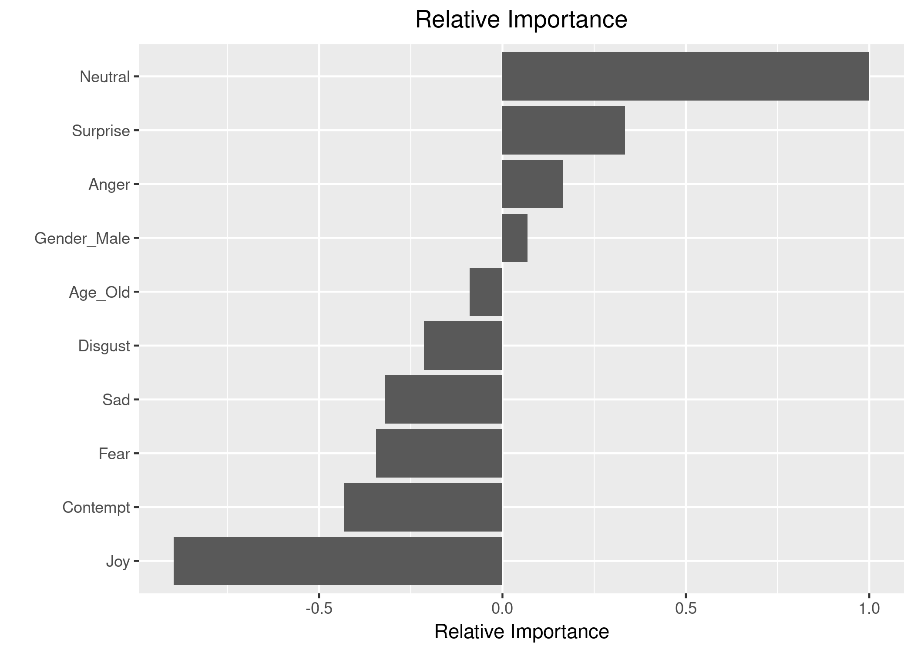
</small></center>

<center><small>**Confusion Matrix and Statistical Summaries**</small></center>
<center><small>
```r
          Reference
Prediction     0     1
         0 22736  4616
         1  2943 14208
                                          
               Accuracy : 0.8301          
                 95% CI : (0.8266, 0.8336)
    No Information Rate : 0.577           
    P-Value [Acc > NIR] : < 2.2e-16       
                                          
                  Kappa : 0.6479          
  Mcnemars Test P-Value : < 2.2e-16       
                                          
            Sensitivity : 0.8854          
            Specificity : 0.7548          

         Pos Pred Value : 0.8312          
         Neg Pred Value : 0.8284          
       
      Balanced Accuracy : 0.8201
  Area Under Curve (AUC): 0.906
```
</small></center>


Model Performance
========================================================

<center>
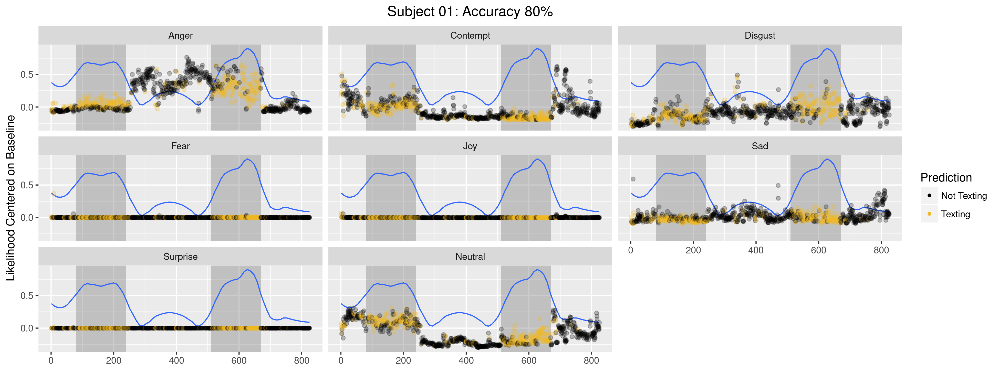
</center>

<small>
* Each point is colored by the prediction of the best model
* The blue line is a LOESS smoother of the probability predition for that corresponding prediction
* The shaded regions represent the actual texting window
* Yellow points within the gray regions represent correct predictions
</small>


Model Performance
========================================================

<center>
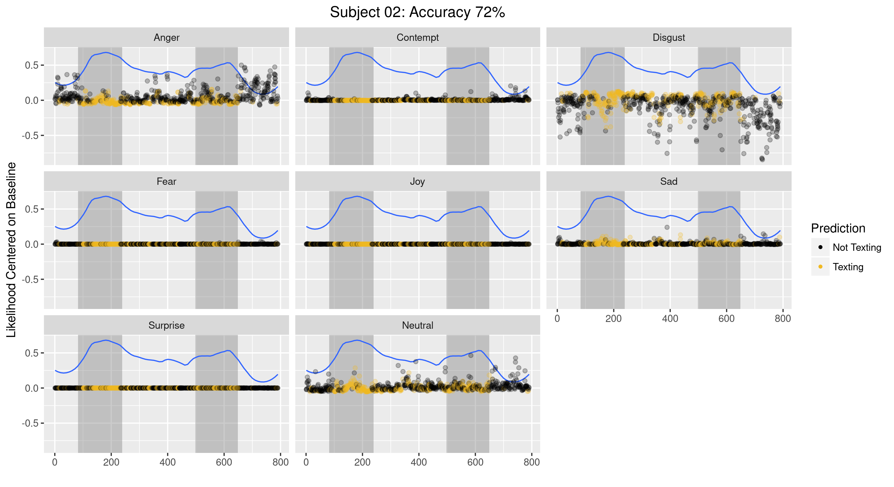
</center>

<center>
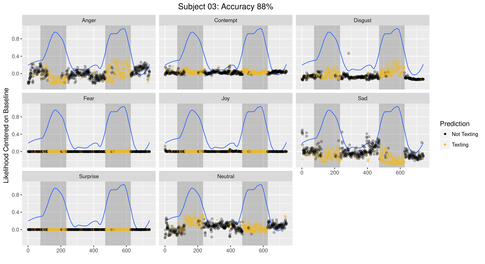
</center>

*****

<center>
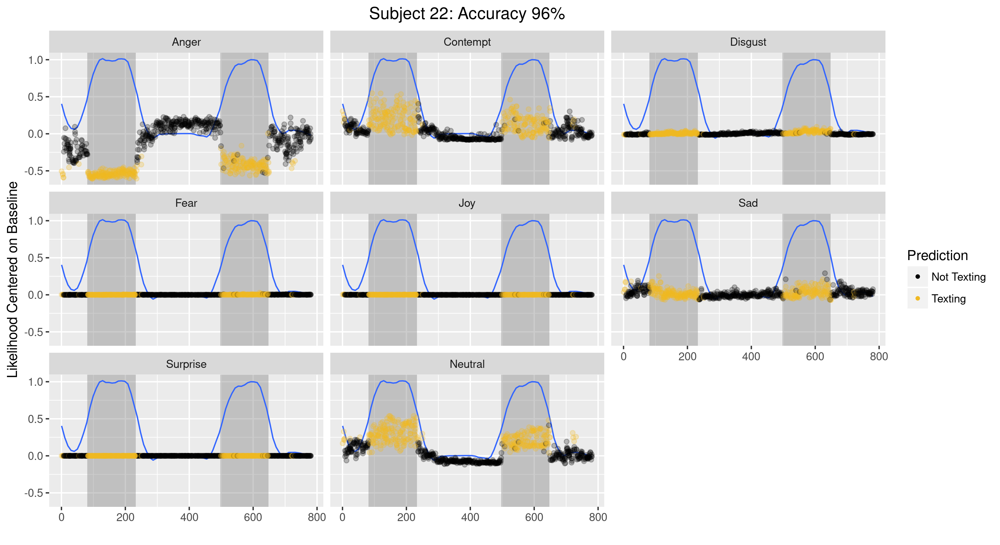
</center>

<center>
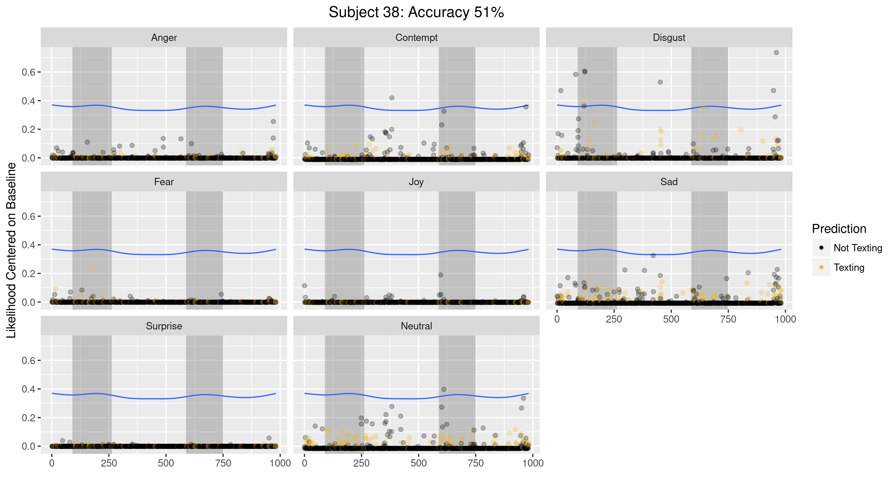
</center>


Model Performance
========================================================
left: 60%

**Total Accuracy by Subject**

<center>

| &nbsp;     | T022  | T086  | T007  | T006  | T018  | T035  | T083  | T076  | T081  | T064  | T020  | T012  | T074  | T009  | T013  | T088  | T003  | T032  | T011  | T044 | **TOP 20** |
|:-----------|:------|:------|:------|:------|:------|:------|:------|:------|:------|:------|:------|:------|:------|:------|:------|:------|:------|:------|:------|:-----|:-----------|
| Train      | 0.981 | 0.960 | 0.919 | 0.943 | 0.940 | 0.956 | 0.956 | 0.949 | 0.929 | 0.922 | 0.931 | 0.928 | 0.925 | 0.914 | 0.907 | 0.937 | 0.907 | 0.915 | 0.916 | .915 | **.932**   |
| Test       | 0.971 | 0.952 | 0.948 | 0.942 | 0.937 | 0.936 | 0.932 | 0.927 | 0.923 | 0.919 | 0.918 | 0.913 | 0.909 | 0.905 | 0.903 | 0.896 | 0.896 | 0.895 | 0.881 | .880 | **.919**   |
| GenderMale | 0     | 0     | 1     | 0     | 0     | 0     | 1     | 1     | 1     | 0     | 0     | 0     | 1     | 1     | 1     | 1     | 1     | 1     | 1     | 1    | **12**     |
| AgeOld     | 0     | 1     | 0     | 0     | 0     | 1     | 1     | 1     | 0     | 0     | 0     | 0     | 1     | 0     | 0     | 1     | 0     | 1     | 0     | 0    | **7**      |


| &nbsp;     | T080  | T016  | T005  | T060  | T039  | T015  | T008  | T046  | T029  | T079  | T051  | T073  | T082  | T024  | T010  | T001  | T066  | T017  | T033  | T042  | **MID 20** |
|:-----------|:------|:------|:------|:------|:------|:------|:------|:------|:------|:------|:------|:------|:------|:------|:------|:------|:------|:------|:------|:------|:-----------|
| Train      | 0.897 | 0.904 | 0.867 | 0.911 | 0.880 | 0.868 | 0.879 | 0.883 | 0.842 | 0.892 | 0.884 | 0.855 | 0.866 | 0.829 | 0.847 | 0.867 | 0.855 | 0.824 | 0.825 | 0.843 | **.865**   |
| Test       | 0.872 | 0.871 | 0.864 | 0.859 | 0.853 | 0.850 | 0.848 | 0.847 | 0.839 | 0.837 | 0.832 | 0.831 | 0.830 | 0.827 | 0.826 | 0.825 | 0.819 | 0.817 | 0.803 | 0.802 | **.837**   |
| GenderMale | 0     | 0     | 1     | 0     | 0     | 1     | 0     | 1     | 0     | 0     | 1     | 0     | 1     | 0     | 0     | 1     | 0     | 1     | 0     | 1     | **8**      |
| AgeOld     | 0     | 0     | 0     | 0     | 1     | 0     | 0     | 1     | 1     | 0     | 1     | 1     | 0     | 0     | 0     | 0     | 0     | 0     | 1     | 1     | **7**      |


| &nbsp;     | T031  | T040  | T061  | T036  | T047  | T084  | T077  | T014  | T004  | T021  | T019  | T002  | T054  | T025  | T041  | T034  | T023  | T038  | T027  | **BOTTOM 19** |
|:-----------|:------|:------|:------|:------|:------|:------|:------|:------|:------|:------|:------|:------|:------|:------|:------|:------|:------|:------|:------|:--------------|
| Train      | 0.846 | 0.814 | 0.796 | 0.800 | 0.789 | 0.803 | 0.792 | 0.828 | 0.771 | 0.812 | 0.746 | 0.742 | 0.774 | 0.760 | 0.719 | 0.704 | 0.711 | 0.674 | 0.651 | **.764**      |
| Test       | 0.794 | 0.790 | 0.787 | 0.783 | 0.782 | 0.776 | 0.766 | 0.758 | 0.758 | 0.757 | 0.742 | 0.735 | 0.731 | 0.724 | 0.720 | 0.700 | 0.682 | 0.665 | 0.640 | **.741**      |
| GenderMale | 0     | 1     | 1     | 1     | 0     | 1     | 0     | 0     | 0     | 1     | 1     | 0     | 1     | 0     | 0     | 1     | 1     | 1     | 0     | **10**        |
| AgeOld     | 1     | 1     | 0     | 1     | 1     | 1     | 1     | 0     | 0     | 0     | 0     | 0     | 1     | 1     | 1     | 1     | 0     | 1     | 1     | **12**        |

</center>

**Proportional Summary**

<center>

|        | Proportion Male | Proportion Old | Proportion Old Male | Proportion Old Female |
|:-------|:---------------:|:--------------:|:-------------------:|:---------------------:|
| Top 20 | 40.0%           | 26.9%          | 35.7%               | 16.7%                 |
| Mid 20 | 26.7%           | 26.9%          | 21.4%               | 33.3%                 |
| Bot 19 | 33.3%           | 46.2%          | 42.9%               | 50.0%                 |

</center>

**********

<br><br><br><br><br><br><br><br><br><br><br><br><br><br><br><br><br><br>

**Takeaways**
<small><small>
* 15 of 59 had testing performance > 90%
* 40 of 59 had testing performance > 80%
*  3 of 59 had testing performance < 70%
*  6 of the 7 worst performing Subjects were Old (4 Male, 3 Female)
* The 15 top performing Subjects (7 Male, 5 Old)

</small></small>


Exploring Modeling Effects
========================================================


<center>
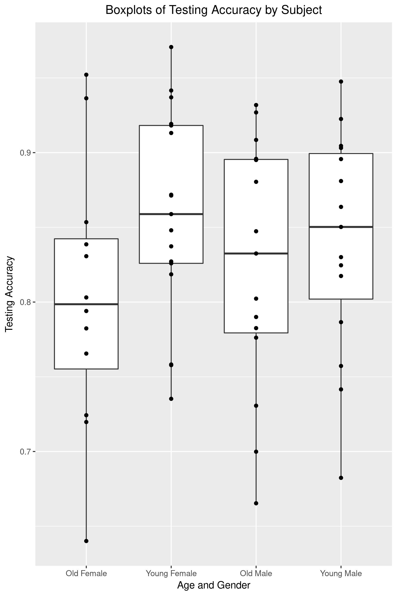
</center>

********

**Evaluating Differences in Age and Gender**
<small>
```r
******************************************************************
Levene's Test for Homogeneity of Variance (Median)
******************************************************************
      Df F value Pr(>F)
group  3  0.3182 0.8122
      55     
      
******************************************************************
General Linear Model
******************************************************************
Deviance Residuals: 
      Min         1Q     Median         3Q        Max  
-0.163277  -0.041330  -0.000279   0.059284   0.148769  

Coefficients:
                      Estimate Std. Error t value Pr(>|t|)    
(Intercept)            0.80337    0.02261  35.534   <2e-16 ***
GenderAgeYoung Female  0.05604    0.02953   1.898    0.063 .  
GenderAgeOld Male      0.02099    0.03033   0.692    0.492    
GenderAgeYoung Male    0.03718    0.03033   1.226    0.226    
---
Signif. codes:  0 ‘***’ 0.001 ‘**’ 0.01 ‘*’ 0.05 ‘.’ 0.1 ‘ ’ 1

(Dispersion parameter for gaussian family taken to be 0.006133847)

    Null deviance: 0.36163  on 58  degrees of freedom
Residual deviance: 0.33736  on 55  degrees of freedom
AIC: -127.25

Number of Fisher Scoring iterations: 2

******************************************************************
Shapiro-Wilk Normality Test
******************************************************************
data:  mdl$residuals
W = 0.97765, p-value = 0.3482
```
</small>


Conclusions
========================================================

