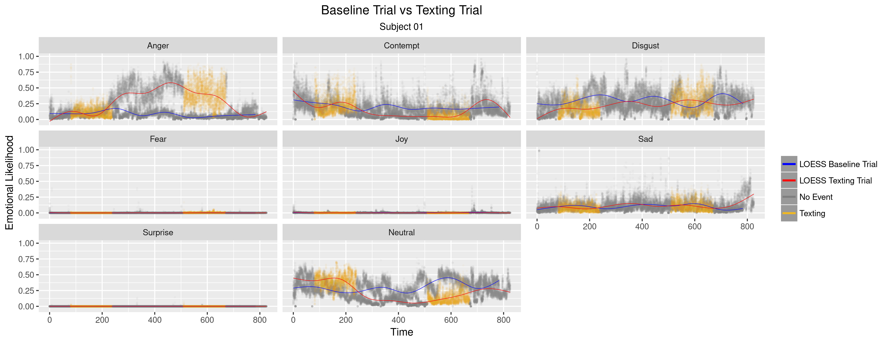
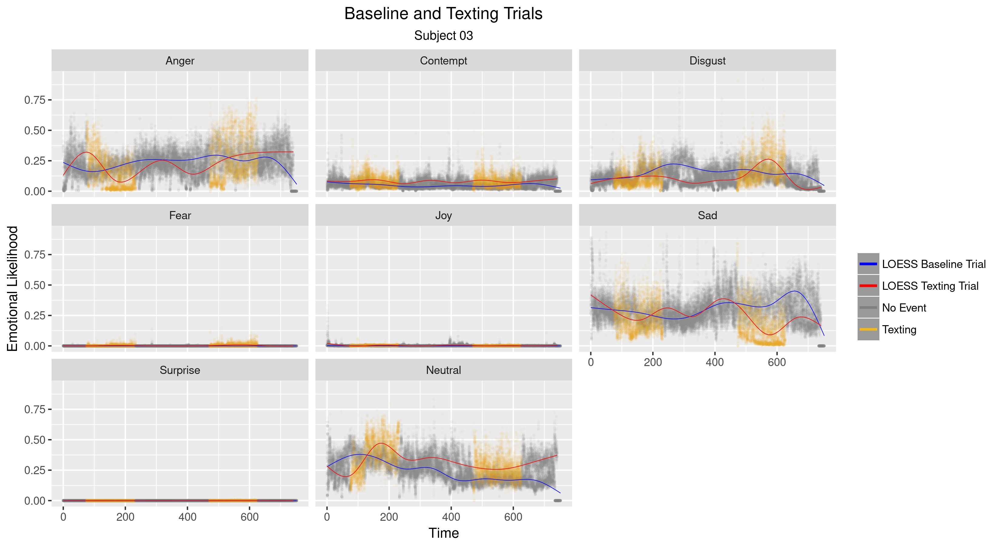
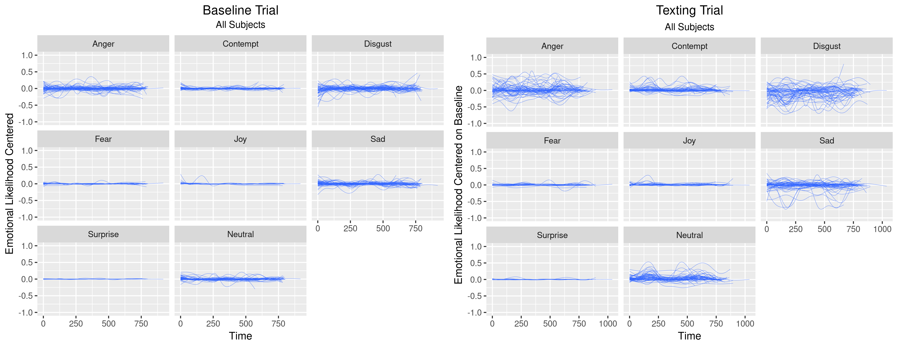
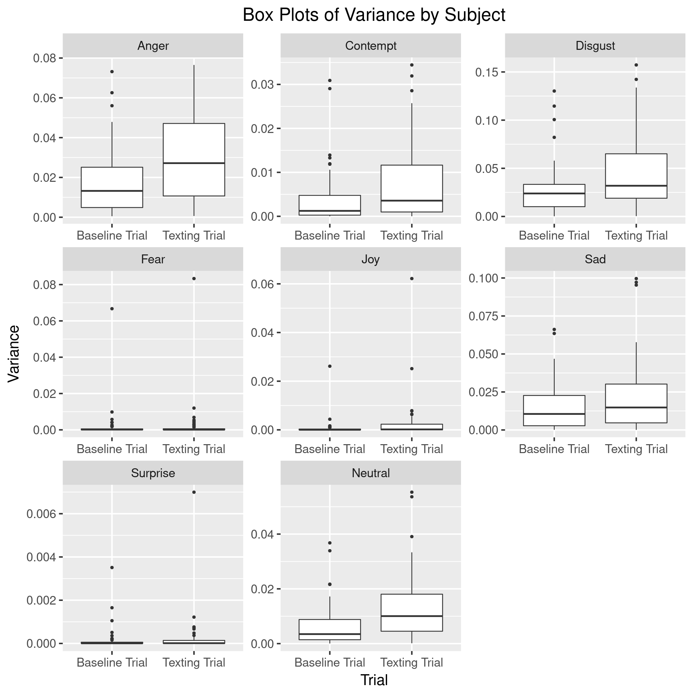
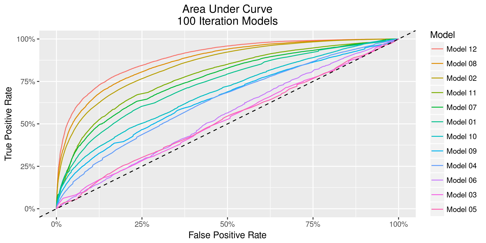
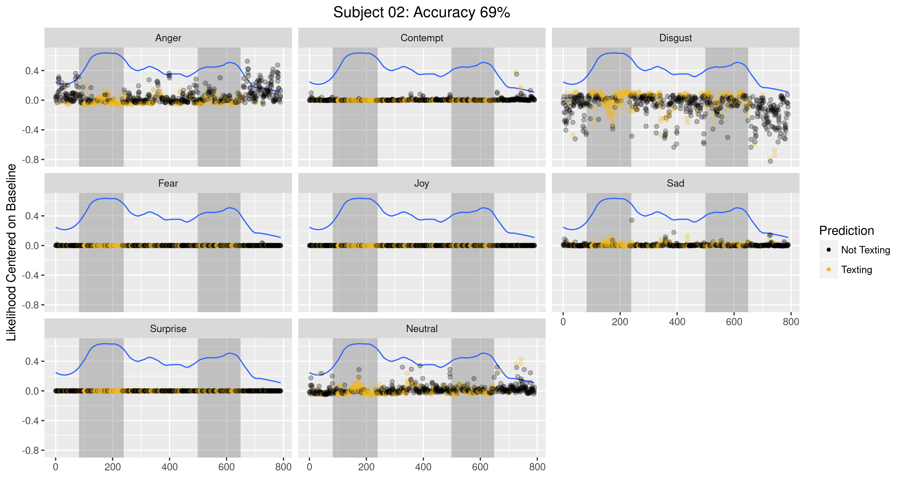
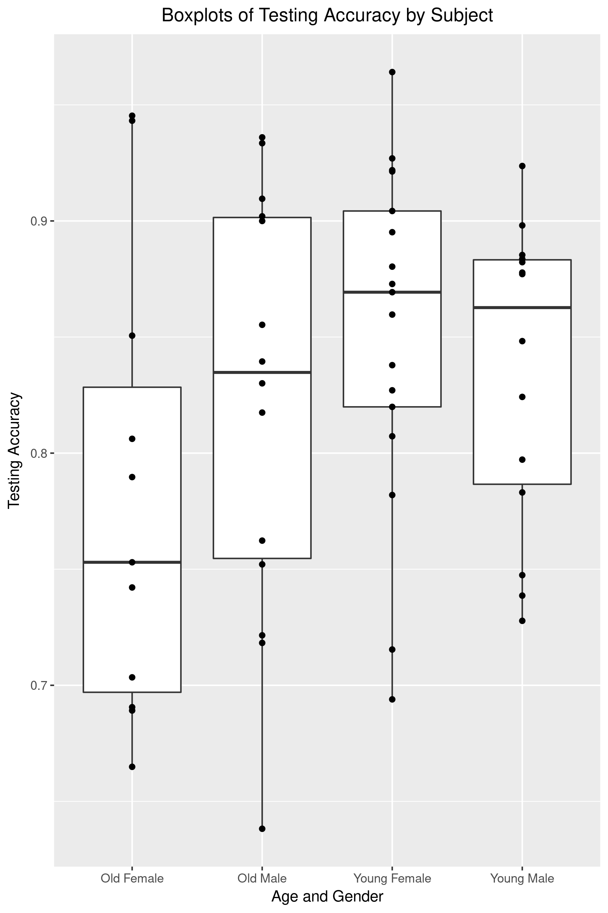

========================================================
autosize: true
font-family: "Consolas"
width: 2100
height: 1400
css: custom.css

<br><br>
<h1><center>Distracted Driving:<br><br>Detecting Texting with<br><br>Neural Networks</center></h1><br>
<style color='#FFFFFF'></style>
<h3 style="color:white" font-family: "DejaVu Sans Mono"><center>Joseph Blubaugh<br><br>29 March 2017</center></h3>


Contents
========================================================
title: true
<br>

* Data Introduction, Extraction, Preparation, and Project Management
* Exploratory Analysis and Model Proposal
* Understanding Basic Neural Nets
* Model Training, Selection, and Performance


Data Introduction, Preparation, and Project Management
========================================================
type: section
title: false

<h1><center>Data Introduction<br><br>Data Extraction and Preparation<br><br>Project Management</center></h1><br>


Data Introduction
========================================================

<center>
<small>
* The data consists of driving simulations for 66 individuals ranging from 3,000 to 30,000 observations per simulation.
* Each observation contains likelihood scores for 8 facial expressions recorded at fixed intervals of .03 seconds.
* Stimuli data, which records events introduced into each simulation, and basic demographic data are also available.
* There are over 6.7 million observations in the entire dataset spread accross 777 files.

**T001-001.xlsx (Subject 01, Simulation 01)**<br>


<br> 
* The dataset used in this project was originally collected and analyzed in **[Dissecting Driver Behaviors Under Cognitive, Emotional, Sensorimotor, and Mixed Stressors](http://www.nature.com/articles/srep25651)**, Scientific Reports 6, Article number: 25651 (2016).

</small>
</center>


Data Extraction
========================================================

<center>
<small>

* **[Python scripts](https://github.com/JestonBlu/Driving/tree/master/Files)** were used to extract and combine the 509 driving simulation files and 267 stimuli files into combined datasets.
* The subject-simulation identifier was the name of each file. A column labeled ID was created based on the file name to identify the original dataset.

</small>
</center>

<center><small>**Sample of data-faces.csv**</small>


| Frame|   Time|  Anger| Contempt| Disgust|   Fear|    Joy|    Sad| Surprise| Neutral|ID       |
|-----:|------:|------:|--------:|-------:|------:|------:|------:|--------:|-------:|:--------|
|     0| 0.0000| 0.0101|   0.0218|  0.0043| 0.0541| 0.5260| 0.0959|   0.0010|  0.2868|T001-001 |
|     1| 0.0333| 0.0101|   0.0218|  0.0043| 0.0541| 0.5260| 0.0959|   0.0010|  0.2868|T001-001 |
|     2| 0.0667| 0.0101|   0.0218|  0.0043| 0.0541| 0.5260| 0.0959|   0.0010|  0.2868|T001-001 |
|     3| 0.1000| 0.0080|   0.0187|  0.0032| 0.0375| 0.5353| 0.1050|   0.0011|  0.2911|T001-001 |
|     4| 0.1333| 0.0091|   0.0380|  0.0158| 0.0036| 0.6902| 0.0177|   0.0004|  0.2252|T001-001 |
|     5| 0.1667| 0.0104|   0.0450|  0.0139| 0.0030| 0.7157| 0.0162|   0.0003|  0.1955|T001-001 |

</center>

<center><small>**Sample of data-stimuli.csv**</small>


| Start|    End| Event.Switch| Event.Type|Event                  |ID       |
|-----:|------:|------------:|----------:|:----------------------|:--------|
|  86.5| 246.50|            1|          1|Analytical Questions   |T001-005 |
| 508.5| 657.50|            1|          2|Mathematical Questions |T001-005 |
| 107.5| 269.25|            1|          3|Emotional Questions    |T001-006 |
| 521.0| 674.75|            1|          3|Emotional Questions    |T001-006 |
|  81.0| 240.00|            1|          4|Texting                |T001-007 |
| 510.0| 671.00|            1|          4|Texting                |T001-007 |

</center>


<center>
<left><div class="note">
  - <small>NOTE: 2 simulation files started on different rows than the rest of the 507 files and had to be manually corrected.</small>
    - <small>T034-005.xlsx: header starts on row 8 </small>
    - <small>T009-006.xlsx: header starts on row 10 </small>
</div>
</center>


Data Preparation
========================================================

<center>
<small>
* Stimuli data captured the starting and ending times of events.
* A loop function was written to process each record and compare time between the simulation and the starting/ending time of the event.
* If the simulation time was between the starting and ending time of an event, then all of the records in the time interval were coded with that event (ie: **Texting**).
* All observations recorded outside the event time interval were coded as **No Event**.
</small>

<br>

<small>**Sample of Processed Data Showing an Event Transition**</small>


|Subject |Trial |Age |Gender | Frame|   Time| Event.Switch|Event    | Action|  Anger| Contempt| Disgust|  Fear|    Joy|    Sad| Surprise| Neutral|
|:-------|:-----|:---|:------|-----:|------:|------------:|:--------|------:|------:|--------:|-------:|-----:|------:|------:|--------:|-------:|
|T001    |007   |Y   |M      |  2427| 80.900|            0|No Event |      0| 0.0909|   0.0575|  0.4205| 3e-04| 0.0011| 0.1343|        0|  0.2954|
|T001    |007   |Y   |M      |  2428| 80.933|            0|No Event |      0| 0.0612|   0.0397|  0.4293| 4e-04| 0.0011| 0.1630|        0|  0.3052|
|T001    |007   |Y   |M      |  2429| 80.967|            0|No Event |      0| 0.1034|   0.0963|  0.3186| 2e-04| 0.0013| 0.0856|        0|  0.3946|
|T001    |007   |Y   |M      |  2430| 81.000|            1|Texting  |      4| 0.0363|   0.4976|  0.0171| 1e-04| 0.0024| 0.0069|        0|  0.4396|
|T001    |007   |Y   |M      |  2431| 81.033|            1|Texting  |      4| 0.0059|   0.7285|  0.0027| 4e-04| 0.0068| 0.0063|        0|  0.2493|
|T001    |007   |Y   |M      |  2432| 81.067|            1|Texting  |      4| 0.0058|   0.6890|  0.0035| 4e-04| 0.0077| 0.0068|        0|  0.2868|

<br>

<left><div class="note">
  - <small>NOTE: The average texting event lasted 2.5 minutes, but it is not clear what occurred during the event time interval. Was there one long texting action or was the event made up of a series of sending and receiving texts?</small>
</div></left>

</center>


Project Management
========================================================

<br>
<small>
**Reproducible Research**

* Code, plots, and this presentation are organized and hosted in a github repository.
* The repository includes steps to reproduce the dataset and models.
* The data for this project are privately owned and not available on the repository at this time.


<br>

<left><div class="note">
<center>
Github Project: [https://github.com/jestonblu/driving](https://github.com/jestonblu/driving)
</center>
</div>
</left>


***

<center>
**Github Project Page**

</center>

</small>


Exploratory Analysis and Model Proposal
========================================================
type: section
title: false

<br><br>
<h1><center>Exploratory Analysis<br><br>and<br><br>Model Proposal</center></h1><br>


Exploratory Analysis
========================================================

<center>

</center>

<center><small>
* **LOESS (Local Polynomial Regression)** lines display the moving average over the entire simulation.
* **Texting Trial** The yellow and gray points represent events during the trials.
* **Baseline Trial** has no events and is gray throughout.
* Many subjects displayed visual differences between the Texting Trial and the Baseline Trial
</small></center>


Exploratory Analysis
========================================================

<center>

</center>

<center>

</center>

*****

<center>

</center>

<center>

</center>


Exploratory Analysis
========================================================

<center>



<small>

* The same LOESS lines were used to show all 59 subjects on a single plot.
* All observations were centered on the overall average of the baseline simulation.
* Anger, Contempt, Disgust, and Neutral displayed more variation than the other emotions for both trials.

</small>
</center>


Model Proposal
========================================================

<br>

<center>

</center>

********

<br> 

<small>

**Summary**
* Differences in variation between the trials suggest that it may be possible to build a model capable of predicting a texting event.
* Subject specific plots are unique enough that a variable for each subject may be needed in modeling.

**Baseline Trial**
* Trial 4 was used as a baseline trial because the conditions were identical to the Texting Trial (dense traffic with detour). 
* The overall mean for each subject's emotion in the Baseline Trial was subtracted from every observation in the Texting Trial.  

**Model Proposal**
* Train a **Feed Forward Neural Network** using emotional likelihoods and demographics to predict when a subject is texting.

**Neural Network Advantages**
* Neural Networks (nnet) are well suited for large datasets of continuous variables.
* Nnets are analogous to logistic regression and appropriate for predicting probabilities.

</small>


Basic Nueral Networks
========================================================
type: section
title: false

<br><br>
<h1><center>Understanding Basic<br><br>Neural Networks</center></h1><br>


Neural Network Basics
========================================================

<small>

<center>
**Basic Neural Network Example**
<br>
</center>

<center>**General Model Form**</center>
<br>
$$nnet(O1 \sim X1 + X2, size = 3)$$


*******

<br><br>


**Tenets of Feed-Forward Neural Networks:**

* Class of statistical learning model;
* Uses a training set for tuning the model and a testing set for measuring performance;
* Similar to logistic regression;
* Typically displayed as a diagram of connected nodes.

<br>

**Neural Network Components**

* **Nodes:**
  * Input Nodes: Input values of the predictor variables;
  * Hidden and Output Nodes: Values are the sum product of the connected weights and nodes values.
* **Weights:** 
  * Represents the transformation that takes place between nodes.
* **Activation Function:** 
  * Transforms the output into an appropriate scale.
  * For logistic regression, the sigmoid function: $S(x) = \frac{1}{1 + \exp(-x)}$

</small>


Neural Network Basics
========================================================

<small>

**Step 1:** Model is initialized with random weights.

<br>

**Step 2:** Calculate hidden weights and output node prediction.

* Hidden node values are the sum product of the connected weights and input nodes:

<center>
$$
\begin{align}
  H1 = & (1)(.2) + (1)(.4) = 0.6, \text{   }S(0.6) = .645 \\
  H2 = & (1)(.1) + (1)(.6) = 0.7, \text{   }S(0.7) = .668 \\
  H3 = & (1)(.7) + (1)(.3) = 1.0, \text{   }S(1.0) = .731 \\
\end{align}
$$
</center>

* Output node prediction:

<center>
$$
  O1 = (.645)(.3) + (.668)(.5) + (.731)(.7) = 1.039 \\
  S(1.039) = .739
$$
</center>

* Model Error: **.739**

<center>
<div class="note">
NOTE: Activation Function <br><br>
$$
\begin{align}
S(x) = & \frac{1}{1 + \exp(-x)}
\end{align}
$$
</div>
</center>

</small>

*******

<center>
<small>**First Iteration of a Basic Neural Network**</small>
<br>
</center>

<center>
<small>
<div class="note">NOTE: Grayed values did not change from previous step.</div>
</small>
</center>


Neural Network Basics
========================================================

<small>
**Step 3:** Update Weights Based on Error.

* Update weights between the hidden layer and output node:

<center>
$$
\begin{align}
  Delta = & S'(.739) = .2187 \\
  \\
  DeltaChange = & (.2187) / [.645, .668, .731] = [.339, .327, .299] \\
  \\
  w_7 = & .645 - .339 = .306 \\
  w_8 = & .668 - .327 = .341 \\
  w_9 = & .731 - .299 = .432 \\
\end{align}
$$
</center>

* Update weights between the input nodes and hidden layer:


<center>
$$
\begin{align}
  DeltaWeights = & Delta / [.3, .5, .7] * S'([.6, .7, 1]) \\
               = & [.167, .097, .061] \\
               \\
  DeltaChange  = & DeltaWeights / [1, 1] \\
               = & [.167, .097, .061, .167, .097, .061] \\
               \\
  w_1 = & .2 - .167 = .033 \\
  w_2 = & .1 - .097 = .003 \\
  w_3 = & .7 - .061 = .639 \\
  w_4 = & .4 - .167 = .233 \\
  w_5 = & .6 - .097 = .503 \\
  w_6 = & .3 - .061 = .239 \\
\end{align}
$$
</center>


*******

**Step 4**: Repeat Step 2 to update the hidden nodes and output prediction.
* S(.633) = .653, Error = **.653** vs previous **.739**

<center>
**First Iteration of a Basic Neural Network**
<br>
</center>

<center><left><div class="note">
NOTE: 
  * Grayed values did not change from previous step
  * $S'(x) = S(x)(1 - S(x))$
</div></left></center>

</small>


Model Fitting and Selection
========================================================
type: section
title: false

<br><br>
<h1><center>Model Fitting and Selection</center></h1><br>


Model Fitting
========================================================
left: 30%

<small>
<center>
**Neural Network Model Design**

</center>

*******

<br><br>
**General Model Form**

$$
\begin{align*}
  nnet(Texting \sim & \text{ } Subject + Age + Gender + Anger + Contempt \text{ } + \\
  & \text{ } Digust + Fear + Joy + Sad + Surprise + Neutral)\\
\end{align*}
$$

**Modeling Strategy**
  * Train the same general model on various slices of the data to see what works best.
  
  * 12 training and testing sets were created from the combination of Data Processing and Data Split methods.
  
  * **Data Processing**
    * **Original**: Emotions in the original form measured in .03 second intervals.
    * **Differencing**: First order differencing of the original observations.
    * **Moving Avg**: Moving averages n=30 for all of the emotions.
    * **1/2 Sec Cut**: Time cut into 1/2 second intervals with the average value recorded.
    * **1/2 Sec Diff**: First order differencing of the 1/2 second cut data.
    * **1/2 Sec Cut Stat**: 1/2 Sec Cut with additional sd, min, max, iqr, and median.<br><br>

  * **Data Split**
    * **365 Split**: The data are split at the 365 second, approximately half way through the texting simulation.
    * **Entire Sim**: The training set is randomly selected from the entire simulation.
</small>


Model Fitting
========================================================

<small>

**Statistical Software**

* R's **[nnet](https://cran.r-project.org/web/packages/nnet/index.html)** package for feed-forward neural networks.

* **The Caret Package:**
  * **[Caret](http://topepo.github.io/caret/index.html)** is a modeling framework for training classification and regression models.
  * It is capable of using models from other packages and offers a rich set of validation tests and diagnostic plots.
  * It can conveniently implement parallel processing for cross validation tasks.<br><br>
  
**Validation Testing and Performance**
  * k=10 cross validation for training sets.
  * AUC (Area Under Curve) and balanced accuracy ((sensitivity + specificity) / 2).<br><br>

**Model Search Parameters**
  * **Max Iterations**: The number of iterations allowed for training.
    * 100   (250, 500 and 1000 iterations are run for the best models)
  * **Size**: The number of nodes in the hidden layer.
    * [1, 10, 25, 50]
  * **Decay**: A penality applied to weights after each iteration.
    * [0, .1, .2] <br><br>
    
<center><div class = "note">
NOTE: Each model is trained 120 times;
* (k=10 cross validation) x (12 combinations of size and decay)
</div></center>

</small>


Model Selection
========================================================
left: 60%

<small>**Model Performance with 100 Iteration Limit**</small>

| Model         | Data Processing      | Data Split     | MaxItr  | Size   | Decay   | Training | Testing  | AUC      |
|:--------------|:---------------------|:---------------|:--------|:-------|:--------|:---------|:---------|:---------|
| Model 1:      | Original             | 365 Split      | 100     | 50     | .20     | .760     | .676     | .734     |
| Model 2:      | Original             | Entire Sim     | 100     | 50     | .20     | .754     | .754     | .847     |
| Model 3:      | Differencing         | 365 Split      | 100     | 10     | .00     | .518     | .516     | .526     |
| Model 4:      | Differencing         | Entire Sim     | 100     | 25     | .10     | .572     | .571     | .637     |
| Model 5:      | Moving Avg           | 365 Split      | 100     | 10     | .00     | .503     | .502     | .527     |
| Model 6:      | Moving Avg           | Entire Sim     | 100     | 10     | .00     | .528     | .528     | .544     |
| Model 7:      | 1/2 Sec Cut          | 365 Split      | 100     | 50     | .10     | .820     | .698     | .761     |
| **Model 8:**  | **1/2 Sec Cut**      | **Entire Sim** | **100** | **50** | **.20** | **.788** | **.779** | **.868** |
| Model 9:      | 1/2 Sec Diff         | 365 Split      | 100     | 50     | .10     | .633     | .602     | .650     |
| Model 10:     | 1/2 Sec Diff         | Entire Sim     | 100     | 50     | .20     | .682     | .622     | .681     |
| Model 11:     | 1/2 Sec Cut Stat     | 365 Split      | 100     | 50     | .10     | .846     | .716     | .781     |
| **Model 12:** | **1/2 Sec Cut Stat** | **Entire Sim** | **100** | **50** | **.20** | **.820** | **.803** | **.891** |

<small>**Additional Training for Best Models**</small>

| Model        | Data Processing  | Data Split     | MaxItr   | Size   | Decay   | Training | Testing  | AUC      |
|:-------------|:-----------------|:---------------|:---------|:-------|:--------|:---------|:---------|:---------|
| Model 8:     | 1/2 Sec Cut      | Entire Sim     | 250      | 50     | .10     | .816     | .804     | .893     |
| Model 8:     | 1/2 Sec Cut      | Entire Sim     | 500      | 50     | .10     | .828     | .810     | .899     |
| **Model 8:** | **1/2 Sec Cut**  | **Entire Sim** | **1000** | **50** | **.10** | **.842** | **.820** | **.906** |
| Model 12:    | 1/2 Sec Cut Stat | Entire Sim     | 250      | 50     | .10     | .858     | .823     | .906     |
| Model 12:    | 1/2 Sec Cut Stat | Entire Sim     | 500      | 50     | .20     | .864     | .823     | .907     |
| Model 12:    | 1/2 Sec Cut Stat | Entire Sim     | 1000     | 50     | .10     | .871     | .824     | .908     |

<div class="note">
<center><small>NOTE: Blue indicates best models.</small></center>
</div>


**********

<br>

<center>
<br>
<br><br>
<br>
</center>


Model Fitting
========================================================


<small>
<center>**Model Training and Validation**</center>

```r
## Set Cross Validation
fit.control = trainControl(method = "cv", number = 10)

## Create model parameters
search.grid = expand.grid(decay = c(0, .1, .2), 
                          size = c(1, 10, 25, 50))

## Limit the iterations and weights
maxIt = 1000; maxWt = 15000

fit = train(Texting ~ . - Time, mdl.08.train, 
            method = "nnet",
            trControl = fit.control,
            tuneGrid = search.grid,
            MaxNWts = maxWt,
            maxit = maxIt)

44503 samples, 12 predictors, 2 classes: '0', '1' 

Resampling: Cross-Validated (10 fold) 
Summary of sample sizes: 40053, 40053, 40052, 40052, ...
Resampling results across tuning parameters:

  ------------------------------
  Decay  Size  Accuracy   Kappa
  ------------------------------
  0.0     1    0.6654     0.3042
  0.0    10    0.7857     0.5519
  0.0    25    0.8135     0.6129
  0.0    50    0.8252     0.6375
  0.1     1    0.6830     0.3182
  0.1    10    0.8052     0.5934
  0.1    25    0.8247     0.6352
  0.1    50    0.8304     0.6472 ## Best Model
  0.2     1    0.6809     0.3126
  0.2    10    0.8033     0.5889
  0.2    25    0.8196     0.6242
  0.2    50    0.8241     0.6336
  
```
</small>

******

<center><small>**Parameter Comparisons**<br>

</small></center>

<center><small>**Confusion Matrix and Statistical Summaries**</small></center>
<center><small>
```
            Reference             Reference
             0     1                0    1
    Pred 0 22736  4616     Pred 0 .885 .245
         1  2943 14208          1 .114 .754  
                                          
               Accuracy : 0.8301          
                 95% CI : (0.8266, 0.8336)
    No Information Rate : 0.577           
                  Kappa : 0.6472
                                          
            Sensitivity : 0.8854          
            Specificity : 0.7548          

         Pos Pred Value : 0.8312          
         Neg Pred Value : 0.8284          
      Balanced Accuracy : 0.8201
      
  Area Under Curve (AUC): 0.906
```
</small></center>


Model Performance
========================================================

<center>


<small>
* Each point is colored by the prediction of the best model.
* The blue line is a LOESS smoother of the probability predition for that corresponding prediction.
* The shaded regions represent the actual texting window.
* Yellow points within the shaded regions represent correct predictions.
</small>

</center>


Model Performance
========================================================

<center>

</center>

<center>

</center>

*****

<center>

</center>

<center>

</center>


Model Performance
========================================================
left: 65%

<small>**Balanced Accuracy by Subject**</small>

<center>

|                | T022  | T007  | T086  | T006  | T018  | T083  | T035  | T076  | T081  | T064  | T020  | T012  | T074  | T088  | T013  | T009  | T032  | T003  | T011  | T080  | **Top 20** |
|:---------------|:------|:------|:------|:------|:------|:------|:------|:------|:------|:------|:------|:------|:------|:------|:------|:------|:------|:------|:------|:------|:-----------|
| **Train**      | 0.982 | 0.920 | 0.956 | 0.941 | 0.935 | 0.956 | 0.951 | 0.949 | 0.927 | 0.921 | 0.932 | 0.923 | 0.923 | 0.938 | 0.896 | 0.911 | 0.915 | 0.899 | 0.902 | 0.896 | **.943**   |
| **Test**       | 0.975 | 0.951 | 0.950 | 0.941 | 0.936 | 0.930 | 0.928 | 0.927 | 0.922 | 0.921 | 0.919 | 0.911 | 0.907 | 0.900 | 0.898 | 0.897 | 0.892 | 0.884 | 0.874 | 0.872 | **.938**   |
| **GenderMale** | 0     | 1     | 0     | 0     | 0     | 1     | 0     | 1     | 1     | 0     | 0     | 0     | 1     | 1     | 1     | 1     | 1     | 1     | 1     | 0     | **11**     |
| **AgeOld**     | 0     | 0     | 1     | 0     | 0     | 1     | 1     | 1     | 0     | 0     | 0     | 0     | 1     | 1     | 0     | 0     | 1     | 0     | 0     | 0     | **7**      |


|                | T016  | T005  | T060  | T044  | T015  | T008  | T079  | T073  | T039  | T082  | T010  | T066  | T029  | T046  | T024  | T051  | T017  | T042  | T001  | T061  | **Mid 20** |
|:---------------|:------|:------|:------|:------|:------|:------|:------|:------|:------|:------|:------|:------|:------|:------|:------|:------|:------|:------|:------|:------|:-----------|
| **Train**      | 0.893 | 0.865 | 0.909 | 0.886 | 0.864 | 0.868 | 0.893 | 0.855 | 0.869 | 0.869 | 0.849 | 0.849 | 0.813 | 0.857 | 0.810 | 0.856 | 0.807 | 0.843 | 0.851 | 0.793 | **.854**   |
| **Test**       | 0.862 | 0.861 | 0.856 | 0.849 | 0.847 | 0.841 | 0.838 | 0.834 | 0.833 | 0.832 | 0.826 | 0.813 | 0.812 | 0.810 | 0.808 | 0.806 | 0.806 | 0.803 | 0.800 | 0.787 | **.826**   |
| **GenderMale** | 0     | 1     | 0     | 1     | 1     | 0     | 0     | 0     | 0     | 1     | 0     | 0     | 0     | 1     | 0     | 1     | 1     | 1     | 1     | 1     | **10**     |
| **AgeOld**     | 0     | 0     | 0     | 1     | 0     | 0     | 0     | 1     | 1     | 0     | 0     | 0     | 1     | 1     | 0     | 1     | 0     | 1     | 0     | 0     | **7**      |


|                | T084  | T077  | T036  | T031  | T033  | T040  | T021  | T014  | T019  | T004  | T002  | T023  | T054  | T041  | T034  | T047  | T025  | T038  | T027  | **Bot 19** |
|:---------------|:------|:------|:------|:------|:------|:------|:------|:------|:------|:------|:------|:------|:------|:------|:------|:------|:------|:------|:------|:-----------|
| **Train**      | 0.806 | 0.794 | 0.789 | 0.810 | 0.768 | 0.782 | 0.802 | 0.815 | 0.742 | 0.728 | 0.717 | 0.748 | 0.741 | 0.698 | 0.688 | 0.703 | 0.699 | 0.559 | 0.540 | **.733**   |
| **Test**       | 0.780 | 0.770 | 0.766 | 0.765 | 0.751 | 0.750 | 0.748 | 0.748 | 0.734 | 0.721 | 0.719 | 0.706 | 0.698 | 0.697 | 0.677 | 0.670 | 0.660 | 0.532 | 0.514 | **.705**   |
| **GenderMale** | 1     | 0     | 1     | 0     | 0     | 1     | 1     | 0     | 1     | 0     | 0     | 1     | 1     | 0     | 1     | 0     | 0     | 1     | 0     | **9**      |
| **AgeOld**     | 1     | 1     | 1     | 1     | 1     | 1     | 0     | 0     | 0     | 0     | 0     | 0     | 1     | 1     | 1     | 1     | 1     | 1     | 1     | **13**     |


</center>

<small>**Summary by Age and Gender**</small>

<center>

|            |  Male  |  Female  |  Old  |  Young  |  Young Male  |  Young Female  |  Old Male  |  Old Female  |
|:-----------|:------:|:---------|:-----:|:--------|:-------------|:---------------|:----------:|:------------:|
| **Top 20** | 36.6%  | 31.0%    | 25.9% | 40.6%   |   40.0%      |  37.5%         |   35.7%    |    16.7%     |
| **Mid 20** | 33.3%  | 34.5%    | 25.9% | 40.6%   |   40.0%      |  43.8%         |   21.4%    |    25.0%     |
| **Bot 19** | 30.0%  | 34.5%    | 48.1% | 18.7%   |   20.0%      |  18.8%         |   42.9%    |    58.3%     |

</center>

**********

<br><br><br><br><br><br><br><br><br><br><br><br><br><br><br><br><br><br>


<small>
* 14 of 59 had testing performance > 90%
* 39 of 59 had testing performance > 80%
*  7 of 59 had testing performance < 70%
*  The 7 worst performing Subjects were all Old

</small>


Exploring Modeling Effects
========================================================


<center>

</center>

********

**Evaluating Differences in Age and Gender**
<small>
```r
******************************************************************
Levene's Test for Homogeneity of Variance (Center = Median)
******************************************************************
      Df F value Pr(>F)
group  1  0.2034 0.6537
      57  
      
******************************************************************
General Linear Model
******************************************************************
Deviance Residuals: 
      Min         1Q     Median         3Q        Max  
-0.269925  -0.047361   0.004553   0.066577   0.184431  

Coefficients:
              Estimate Std. Error t value Pr(>|t|)    
(Intercept)   0.76528    0.02732  28.011   <2e-16 ***
Old Male      0.03652    0.03665   0.996   0.3234    
Young Female  0.08808    0.03568   2.468   0.0167 *  
Young Male    0.07124    0.03665   1.943   0.0571 .  
---
Signif. codes:  0 ‘***’ 0.001 ‘**’ 0.01 ‘*’ 0.05 ‘.’ 0.1 ‘ ’ 1

(Dispersion parameter for gaussian family taken to be 0.008957086)

    Null deviance: 0.55633  on 58  degrees of freedom
Residual deviance: 0.49264  on 55  degrees of freedom
AIC: -104.91

Number of Fisher Scoring iterations: 2

******************************************************************
Shapiro-Wilk Normality Test
******************************************************************
data:  mdl$residuals
W = 0.97066, p-value = 0.1645
```
</small>


Conclusions
========================================================

<small>

* Neutral, Surprise, and Anger were the most important emotions for successfully identifying texting.


* Joy, Contempt, and Fear are the least important emotions for identifying texting.


* Young Females had the best overall testing performance while Older Females had the worst overall testing performance.

  * At the 95% confidence level, the testing accuracy between Young Females and Old Females are different.
  * At the 90% confidence level, the testing accuracy between Young Males and Old Females are different.


* The variable importance plot from the training model indicated that gender is more important than age. The testing accuracy results by subject somewhat contradict this claim.


* After extending the training iterations, the difference between Model 8 (1/2 Sec Cut) and Model 12 (1/2 Sec Cut Stat) are negligible. This suggests that there is much more information in the average likelihood score than in the other descriptive statistics (sd, min, max, iqr).


</small>


