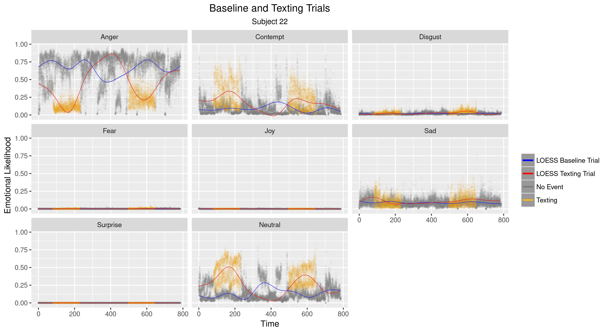

========================================================
autosize: true
font-family: "DejaVu Sans Mono"
width: 2100
height: 1400
css: custom.css

  
<h1>
Distracted Driving:  Detecting Texting with  Neural Networks
</h1> 

<h3 style="color:white" font-family: "DejaVu Sans Mono">
Joseph Blubaugh  29 March 2017
</h3>

Contents
========================================================
title: true
 

* Data Introduction, Preparation, and Project Management
* Exploratory Analysis and Model Proposal
* Understanding Basic Neural Nets
* Model Training and Selection
* Exploring Model Effects

Data Introduction, Preparation, and Project Management
========================================================
type: section
title: false

<h1>
Data Introduction  Data Extraction and Preparation  Project Management
</h1> 

Data Introduction
========================================================

* <small>The data in this project are of 8 driving simulations for 66 individuals ranging from 3,000 to 30,000 observations per simulation.</small>
* <small>Every simulation observation contains likelihood scores for 8 facial expressions recorded at a fixed interval of .03 seconds.</small>
* <small>Stimuli data which records targetted events introduced into each simulation and basic demographic data on each subject are also available.</small>
* <small>There are over 6.7 million observations in the entire dataset spread accross 777 files.</small>

**T001-001.xlsx (Subject 01, Simulation 01)** 

  

* <small>The data set used in this project was originally collected and analyzed in **[Dissecting Driver Behaviors Under Cognitive, Emotional, Sensorimotor, and Mixed Stressors](http://www.nature.com/articles/srep25651)**, Scientific Reports 6, Article number: 25651 (2016).</small>

Data Extraction
========================================================

* <small>**[Python scripts](https://github.com/JestonBlu/Driving/tree/master/Files)** were used to extract and combine the 509 driving simulation files and 267 stimuli files into combined data sets.</small>
* <small>The subject-simulation identifier was the name of each file. A column labeled ID was created based on the file name to identify the original data set.</small>

**Sample of data-faces.csv**

| Frame|   Time|  Anger| Contempt| Disgust|   Fear|    Joy|    Sad| Surprise| Neutral|ID       |
|-----:|------:|------:|--------:|-------:|------:|------:|------:|--------:|-------:|:--------|
|     0| 0.0000| 0.0101|   0.0218|  0.0043| 0.0541| 0.5260| 0.0959|   0.0010|  0.2868|T001-001 |
|     1| 0.0333| 0.0101|   0.0218|  0.0043| 0.0541| 0.5260| 0.0959|   0.0010|  0.2868|T001-001 |
|     2| 0.0667| 0.0101|   0.0218|  0.0043| 0.0541| 0.5260| 0.0959|   0.0010|  0.2868|T001-001 |
|     3| 0.1000| 0.0080|   0.0187|  0.0032| 0.0375| 0.5353| 0.1050|   0.0011|  0.2911|T001-001 |
|     4| 0.1333| 0.0091|   0.0380|  0.0158| 0.0036| 0.6902| 0.0177|   0.0004|  0.2252|T001-001 |
|     5| 0.1667| 0.0104|   0.0450|  0.0139| 0.0030| 0.7157| 0.0162|   0.0003|  0.1955|T001-001 |

**Sample of data-stimuli.csv**

| Start|    End| Event.Switch| Event.Type|Event                  |ID       |
|-----:|------:|------------:|----------:|:----------------------|:--------|
|  86.5| 246.50|            1|          1|Analytical Questions   |T001-005 |
| 508.5| 657.50|            1|          2|Mathematical Questions |T001-005 |
| 107.5| 269.25|            1|          3|Emotional Questions    |T001-006 |
| 521.0| 674.75|            1|          3|Emotional Questions    |T001-006 |
|  81.0| 240.00|            1|          4|Texting                |T001-007 |
| 510.0| 671.00|            1|          4|Texting                |T001-007 |

<left>

  - <small>NOTE: 2 simulation files started on different rows than the rest of the 507 files and had to be manually corrected.</small>
    - <small>T034-005.xlsx: header starts on row 8 </small>
    - <small>T009-006.xlsx: header starts on row 10 </small>

Data Preparation
========================================================

* <small>The event data captured the starting and ending times of events only.</small>
* <small>A loop function was written to go through each record and compare time between the simulation and the starting/ending time of the event.</small>
* <small>If the simulation time fell within the starting/ending time interval in the event data, then all of the records in the time interval were coded with that event (ie: **Texting**)</small>
* <small>All observations outside of the event time interval were coded as **No Event**.</small>

 

**Sample of Cleaned Data Showing an Event Transition**

|Subject |Trial |Age |Gender | Frame|   Time| Event.Switch|Event    | Action|  Anger| Contempt| Disgust|  Fear|    Joy|    Sad| Surprise| Neutral|Texting |
|:-------|:-----|:---|:------|-----:|------:|------------:|:--------|------:|------:|--------:|-------:|-----:|------:|------:|--------:|-------:|:-------|
|T001    |007   |Y   |M      |  2427| 80.900|            0|No Event |      0| 0.0909|   0.0575|  0.4205| 3e-04| 0.0011| 0.1343|        0|  0.2954|0       |
|T001    |007   |Y   |M      |  2428| 80.933|            0|No Event |      0| 0.0612|   0.0397|  0.4293| 4e-04| 0.0011| 0.1630|        0|  0.3052|0       |
|T001    |007   |Y   |M      |  2429| 80.967|            0|No Event |      0| 0.1034|   0.0963|  0.3186| 2e-04| 0.0013| 0.0856|        0|  0.3946|0       |
|T001    |007   |Y   |M      |  2430| 81.000|            1|Texting  |      4| 0.0363|   0.4976|  0.0171| 1e-04| 0.0024| 0.0069|        0|  0.4396|1       |
|T001    |007   |Y   |M      |  2431| 81.033|            1|Texting  |      4| 0.0059|   0.7285|  0.0027| 4e-04| 0.0068| 0.0063|        0|  0.2493|1       |
|T001    |007   |Y   |M      |  2432| 81.067|            1|Texting  |      4| 0.0058|   0.6890|  0.0035| 4e-04| 0.0077| 0.0068|        0|  0.2868|1       |

 

<left>

  - <small>NOTE: The average texting event lasted 2.5 minutes, but we dont really know what occurred during the event time interval. Was there one long texting action or was the event made up of a series of sending and receiving texts?</small>

</left>

Project Management
========================================================

 

**Reproducible Research**

* <small>Code, plots, and this presentation are organized and hosted in a github repository.</small>
* <small>The main page includes steps to reproduce the data set and models</small>
* <small>The data is too large to be hosted and would need to be retrieved elsewhere</small>

 

<left>

<small>Github Project: [https://github.com/jestonblu/driving](https://github.com/jestonblu/driving)</small>

</left>

***

**Github Project Page**

Exploratory Analysis and Model Proposal
========================================================
type: section
title: false

  
<h1>
Exploratory Analysis  and  Model Proposal
</h1> 

Exploratory Analysis
========================================================

* <small>The yellow and gray points represent events during the trials</small> 
* <small>The baseline trial has no events and is gray throughout.</small>
* <small>**LOESS (Local Polynomial Regression)** lines display the moving average over the entire simulation</small>
* <small>Many subjects displayed visual differences between the texting simulation and the baseline simulation</small>

Exploratory Analysis
========================================================

*****

Exploratory Analysis
========================================================

* <small>The same LOESS lines were used to show all 59 subjects on a single plot</small>
* <small>All observations were centered on the overall average of the baseline simulation</small>
* <small>Anger, Contempt, Disgust, and Neutral displayed more variation than the other emotions for both trials</small>

Model Proposal
========================================================

********

  

**Takeaways**

* <small>Differences in variation between the trials suggest that it may be possible to build a model capable of predicting a texting event</small>

* <small>Subject specific plots are unique enough that a individual subjects variables may be needed in modeling</small>

* <small>**Baseline Trial**: Trial 4 was used as a baseline trial because the conditions were identical to the Texting Trial (dense traffic with detour)</small>

 

**Model Proposal**: 

* <small>Train Neural Networks using emotional likelihoods and demographics to predict when a subject is texting</small>
  * <small>Well suited for large data sets of continuous variables</small>
  * <small>Analogous to logistic regression and appropriate for predicting probabilities</small>

Basic Nueral Networks
========================================================
type: section
title: false

  
<h1>
Understanding Basic  Neural Networks
</h1> 

Neural Network Basics
========================================================

 

**Feed-Forward Neural Networks**
* <small>Class of Statistical Learning model</small>
* <small>Similar to logistic regression</small>
* <small>Typically displayed as a diagram of connected nodes</small>

 

**Nnet Components**
* <small>**Nodes:**</small>
  * <small>Input Nodes: Input values of the predictor variables</small>
  * <small>Hidden and Output Nodes: Value are the sumproduct of the connected weights</small>
* <small>**Weights:** Represent the transformation that takes place between nodes</small>
* <small>**Activation Function:** Transforms the output into an appropriate scale</small>
  * <small>For logistic regression, the sigmoid function: $S(x) = \frac{1}{1 + \exp(-x)}$</small>

*******

**Basic Neural Network**
 

**General Model Form**

 
$$nnet(O1 \sim X1 + X2, size = 3)$$

Neural Network Basics
========================================================

**Step 1:** Initialize Model Weights are Random

 

**Step 2:** Calculate Hidden Weights and Output Node Prediction

* <small>Hidden Node values are the sum product of the connected weights</small>

<small>
$$
\begin{align}
  H1 = & (1)(.2) + (1)(.4) = .6, S(.6) = .645 \\
  H2 = & (1)(.1) + (1)(.6) = .7, S(.7) = .668 \\
  H3 = & (1)(.7) + (1)(.3) = 1, \text{ }  S(1) \text{ } = .645 \\
\end{align}
$$
</small>

* <small>Output Node Prediction</small>

<small>
$$
  O1 = (.645)(.3) + (.668)(.5) + (.731)(.7) = 1.049 \\
  S(1.049) = .7406
$$
</small>

* <small>Model Error: **.7406**</small>

NOTE: Activation Function
$$
\begin{align}
S(x) = & \frac{1}{1 + \exp(-x)}
\end{align}
$$

*******

**First Iteration of a Basic Neural Network**
 

NOTE: Grayed values did not change from previous step

Neural Network Basics
========================================================

**Step 3:** Update Weights Based on Error

* <small>Update Weights between Hidden Layer and Output Node</small>

<small>
$$
\begin{align}
  Delta = & S'(-.7406) = -.1619 \\
  DeltaChange = & (-.1619) / [.645, .608, .731] \\
               = &[-.251, -.242, -.221] \\
               \\
  w_7 = & .645 - .251 = .394 \\
  w_8 = & .668 - .242 = .426 \\
  w_9 = & .731 - .221 = .51 \\
\end{align}
$$
</small>

* <small>Update Weights between Input Node and Hidden Layer</small>

<small>
$$
\begin{align}
  DeltaWeights = & Delta / [.3, .5, .7] * S'([.6, .7, 1]) \\
               = & [-.1234, -.0717, -.0454] \\
  DeltaChange  = & [-.1234, -.0717, -.0454] / [1, 1] \\
               = & [-.1234, -.0717, -.0454, \\
                 &  -.1234, -.0717, -.0454] \\
               \\
  w_1 = & .2 - .123 = .077 \\
  w_2 = & .1 - .071 = .029 \\
  w_3 = & .7 - .045 = .655 \\
  w_4 = & .4 - .123 = .277 \\
  w_5 = & .6 - .071 = .529 \\
  w_6 = & .3 - .045 = .255 \\
\end{align}
$$
</small>

*******

**Step 4**: Repeat Steps 2-3 to update the hidden and output node values
* <small>S(.551) = .634, Error = **.634** vs previous **.740**</small>

**First Iteration of a Basic Neural Network**
 

<left>

* <small>Grayed values did not change from previous step</small>
* <small>$S'(x) = S(x)(1 - S(x))$</small>

</left>

